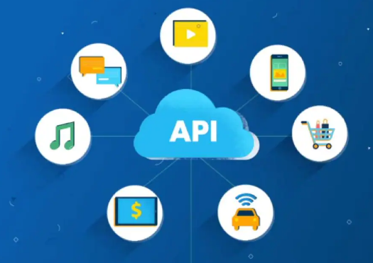

# APIs REST - WebApis

## Que son las API y para que sirven?

Una API (Application Programming Interface) es un conjunto de definiciones y protocolos que se utiliza para desarrollar e integrar el software de las aplicaciones. 

Las API permiten que sus productos y servicios se comuniquen con otros, sin necesidad de saber como estan implementados. Las APIs otorgan flexibilidad, simplifican el diseño, la administracion y el uso de las aplicaciones, y proporcionan oportunidades de innovacion, lo cual es ideal al momento de diseñar herramientas y productos nuevos (o de gestionar los actuales).

A veces, las APIs se consideran como contratos (interfaz), con documentación que representa un acuerdo entre las partes, si una de las partes envía una solicitud remota con cierta estructura particular, es misma estructura determinara como responderá el software de la otra parte.

En términos mas simples, una API es un tipo de interfaz la cual expone un conjunto de funciones que permite a desarrolladores independientes poder acceder a cierta informacion expuesta por estas funciones.

En resumen, una API es el mecanismo más util para conectar dos softwares entre si para el intercambio de mensajes o datos en un formato estándar. 

## Ahora que sabemos lo que es una API, que es una WebApi?

Como el nombre lo indica, es una API especifica. Este tipo de APIs es utilizada a traves de la web.

Las ApisWeb funcionan con las limitaciones del estilo arquitectonico REST, las cuales se denominan RESTful API.

Es importante decir que estamos mencionando un concepto y no una tecnologia. Lo que significa que las RESTful API no estan ligadas a una tecnologia en particular. Se pueden encontrar RESTful APIs desarrolladas en Java, JavaScript, .NET, etc.

## Que es ASP .NET Core Web API?

Es el framework creado por Microsoft que corre sobre .NET Core. Es un framework extensible para crear servicios basados en HTTP REST, los cuales pueden ser accedidos mediante cual quier cliente. 

Algunas caracteristicas interesantes sobre este framework son:

- Parseo automatico a JSON, el cual puede ser customizable (este proceso se llama deserializacion de objeto a JSON)
- Parseo automatico a objetos, el cual puede ser customizable (este proceso se llama serializable de JSON a objeto)
- Herramientas de autenticacion
- Definicion simple de recursos
- Tooling en varias plataformas para que el desarrollo sea comodo y facil
- Orientado a APIs REST

## Hablemos sobre REST

REST o Representational State Transfer es un estilo de arquitectura, a la hora de realizar una comunicacion entre cliente y servidor.

Habitualmente cuando nosotros realizamos una comunicacion cliente-servidor accedemos al servidor en un punto de acceso, le enviamos una informacion y recibimos un resultado. Esta comunicacion es sin estado en estos tipos de servidores, eso quiere decir que el cliente en la request tiene que mandar la informacion necesaria para que el servidor lo autentique y le de permisos para realizar la operacion que quiera hacer. Este estado es informacion que se puede encontrar en la URI, Header, Body de la request, pero es mas frecuente tenerlo en el Header. Del lado del cliente este va a guardar el estado necesario de alguna forma (por ejemplo en la web de forma de cookies) para mandarla en la request y el servidor tendra almacenado la sesion en una base de datos por ejemplo par apoder autenticar.

Ahora esta comunicacion se puede realizar de varias formas posibles, pero hoy por hoy una de las necesidades mas claras es que esa comunicacion sea abierta y podamos acceder desde cualquier sitio sin importar el tipo de cliente que seamos. Estamos hablando de una comunicacion utilizando el protocolo HTTP (Hyper Text Transfer Protocol). Como logramos esto? En nuestro servidor vamos a tener un puerto reservado para nuestra API (ejemplo el 80) el cual cualquiera del mundo tendra acceso a la informacion que la API exponga desde cualquier lado.

Una vez que establecimos el protocolo de comunicacion, se tiene que definir la tipologia de mensajes que se va a enviar. 

En que formato van a viajar los mensajes? XML o JSON. 

Una vez establecido este formato estaremos listo para el intercambio de mensajes. Una api es un servicio que provee interoperabilidad con otros servicios ya que permite el intercambio significante de informacion mediante interfaces en un contexto particular. No solo se considera la habilidad de intercambiar data (sintaxis) sino que tambien la habilidad de interpretar correctamente la data que esta siendo intercambiada (semantica).

Por defecto la serializacion de los mensajes de una API es con formato JSON.

## Algunos proveedores de Apis REST son:

- Twitter: acceso a datos de usuarios, estado
- Google: googleMaps
- Facebook
- YouTube
- GitHub
- Amazon
- Entre otros

## Definamos algunos conceptos claves

### 1. Endpoint/Recurso

En vez de tener servicios que exponen diversos comportamientos, vamos a exponer endpoints asociados a los diferentes servicios y comportamientos, estos endpoints son definidos como URI (Uniform Resource Identifier).

Entonces, que es realmente un recurso? a que se le llama recurso? Un recurso es una URI la cual es conocida por el mundo y es el identificador para realizar diferentes acciones en la API, aplicar diferentes verbos HTTP.

La creacion de un endpoint deberia respetar las siguientes caracteristicas:

1. **Sustantivos ante verbos**. 
    1. .../*dogs* → URI para manipular perros
    2. .../*users →* URI para manipular usuarios
    3. .../*sessions →* URI para manipular sesiones
2. **Intuitiva y simple.** Esto es fundamental para que el uso de la API sea intuitiva y simple. Si mediante la URI se puede entender lo que hace la API sin necesitar ningun tipo de documentacion extra, sera mas simple de utilizarla.
3. **Plural ante singular**. Esto facilita la interpretacion de nuestra API, ya que queda mas intuitiva. Es importante recalcar que no se tienen que mezclar.
4. **En minuscula**
5. **Nombres concretos ante abstractos**. Los desarrolladores siempre buscan niveles de abstracciones altos, pero esto es contraproduciente en la creacion de recursos porque tenderan a ocultar implementaciones concretas y a no saber cual es la respuesta exacta a ese recurso.
    1. Bien:
        1. ../*dogs*
        2. ../*admins*
    2. Evitar:
        1. ../things
        2. ../*someone*
6. **Recursos con relaciones**. Vamos a encontrar muchos recursos con relaciones hacia otro recurso y probablemente queramos obtener algo en particular de ese recurso.
    1. Bien:
        1. ../owners/1/dogs
    2. Evitar:
        1. ../*users/1/dogs/2*
7. **Hacer uso de ? para ocultar complejidad**.
8. **Verbos fuera de la URI**. El uso de los verbos tiene que estar explicito en la request y no en la URI. El evitar los verbos en la URI evitamos crear URIs especificas a acciones especificas las cuales para el momento sirven pero no son mantenibles.
    1. Bien:
        1. ../*dogs*?*leashed=true*
        2. ../*dogs*
    2. Evitar:
        1. ../*getAllLeashedDogs*
        2. ../*getHungerLevel*

### 2. Verbo HTTP

Vamos a utilizar 4 verbos, GET, POST, PUT y DELETE, para obtener, agregar, modificar y eliminar elementos. La combinación de estas operaciones hace que REST sea CRUD.

La aplicacion de los diferentes verbos al mismo endpoint tienen significados diferentes. Veamoslo en una tabla con el endpoint *dogs:*

Veamos cuales de los verbos son idempotentes. Un verbo es idempotente cuando no importa las veces que lo aplique, el servidor siempre me va a responder lo mismo.

1. GET es idempotente. Siempre que tire una request con el verbo GET me va a devolver los mismos elementos.
2. POST no es idempotente. La primera ejecucion me crea un elemento, a la segunda ejecucion no lo crea, o lo crea, pero de igual manera esta cambiando el estado del servidor lo cual introduce variante en el estado.
3. PUT depende del dominio. Es idempotente si se permiten varias modificaciones al mismo elemento, no es idempotente si no se permiten varias modificaciones al mismo elemento.
4. DELETE no es idempotente. El intentar eliminar un elemento que ya esta eliminado no devuelve el mismo resultado que la primera ejecucion de una eliminacion.

### 3. Manejo de errores

Muchos desarrolladores de software no siempre piensan sobre las excepciones que pueden suceder y como manejarlas pero no deja de ser muy importante en la vida del desarrollo del software y especialmente al diseño de las APIs.

**Porque es importante un buen diseño de errores en el diseño de la API?**

Desde la perspectiva del desarrollador que consume nuestra Web API, todo del otro lado de la interfaz es desconocido, es una caja negra. Por lo tanto errores se convierten en una herramienta para proveer un contexto y visibilidad en como usar la API.

Primero, los desarrolladores escriben codigo mediante errores. El concepto "test-first" y mas recientemente el "test-driven-development" representan el una estrategia de buenas practicas para trabajar de forma natural entre desarrolladores.

Segundo, desarrolladores dependen de un buen diseño de errores en tiempos criticos cuando estan complicados o resolviendo problemas despues de que las aplicaciones que usan nuestra API estan en manos de usuarios.

**Veamos como considerar errores de forma practica en REST**

Tomemos como ejemplo tres TOP APIs:

           **Facebook**

**Facebook**

No importa que pasa con la request, siempre vas a obtener el codigo 200 que significa que esta todo bien. El contenido de la respuesta es lo que determina el estado de la misma, como podemos ver se ve un codigo de error 803 pero sin informacion sobre que es 803 o como reaccionar sobre el.

**Twilio**

Su api es ejemplar en como tratar los codigos de error, porque se encarga de alinear los errores con el codigo HTTP. Aca podemos ver como en Facebook que tienen un codigo de error interno pero se encargan de linkearlo a la documentacion. Esto nos da un contexto de que salio mal y como solucionarlo.

**SimpleGeo**

Simplemente brinda un buen manejo de codigo HTTP pero no buena informacion sobre el origen del error.

**Que se tiene que hacer con los errores?**

1. **Usar HTTP status code.** 

Hay mas de 70 codigos HTTP, esto no quiere decir que hay que usarlos todos. La mayoria de los desarrolladores no los conocen todos. Entonces si utilizas codigos pocos conocidos se esta guiando, a los desarrolladores que consuman nuestra API, hacia Wikipedia para que sepan cual es el significado del codigo de error que les esta llegando en su aplicacion.

Por lo tanto hay que usar un numero chico de codigos de error. Por ejemplo Google GData API usa solo 10 codigos de error, Netflix usa 9 y Diggy solamente 8.

Veamos cuales son esos:

 

Lo que nos lleva a la siguiente pregunta: **Cuantos codigos de error debo de usar en la API?**

Los codigos de error los podemos dividir en 3 grandes categorias segun el resultado en la interaccion entre la app y la API:

1. Todo salio bien - success - 2xx
2. La aplicacion hizo algo mal - client error - 4xx
3. La API hizo algo mal - server error - 5xx

Entonces podemos empezar con 3 codigos y si la aplicacion necesita mas se pueden agregar pero no deberian de ser mas de 8.

- 200 - Ok
- 400 - Bad Request
- 500 - Internal Server Error

Si no estas conforme con estos 3, podemos tratar estos 5:

- 201 - Created
- 304 - Not Modified
- 404 - Not Found
- 401 - Unauthorized
- 403 - Forbidden

En caso de que quieran saber mas sobre los 70 códigos de error, vean: [**List of HTTP status codes**](https://en.wikipedia.org/wiki/List_of_HTTP_status_codes)

Es importante el código de HTTP así las aplicaciones clientes que consumen nuestra API pueden tomar diferentes acciones dependiendo el mismo con un if else por ejemplo.

2. **Payload/body de la response:**

Se tiene que ser lo mas explicativo del error posible. Dejemos los codigos para el codigo y los mensajes para las personas.

**Codigo para codigo**

**Mensaje para las personas**

En resumen, sean explicativos en el body de la response del origen del error y como solucionarlo y utilicen pocos y conocidos codigos HTTP.

### 4. Versionado

Es uno de las consideraciones mas importantes con respecto al diseño de la Web Api.

Veamos como las APIs mencionadas anteriormente realizan su versionado:

**Twilio** utiliza el timestamp en la URI (formato Europeo). 

En tiempo de compilacion, el desarrollador incluye el timestamp de la aplicacion cuando el codigo fue compilado. Este timestamp tiene que estar en todas las request HTTP.

Cuando la request llega, Twilio hace un look up, basandose en el timestamp que identifica la API que era valida cuando ese codigo fue creado y lo redirecciona.

Este enfoque es un poco complejo y demasiado cuando tratamos el versionado de la API. Puede llegar a la confusion de si ese timestamp es de tiempo de compilacion o de released.

[**salesforce.com](http://salesforce.com)** usa **v20.0** ubicado en algun lugar del medio de la URI.

Es bueno el uso de la notacion **v**. Sin embargo no es correcto el uso de **.0** porque implica que la interfaz puede cambiar mas frecuentemente de lo que deberia. La logica por detras de la interfaz puede cambiar rapidamente pero la interfaz no deberia hacerlo.

**Facebook** tambien usa la notacion **v** pero es un parametro opcional.

Esto es problematioc porque cuando Facebook fuerce el cambio de version a la siguiente, todas las apps que no tenian incluido el numero de version se rompen y tienen que darse de baja, cambiar el numero y volver a subirse.

**Entonces, cual es la mejor forma del versionado?**

1. Nunca hacer un release de una API sin el versionado. Tiene que ser obligatorio.
2. El versionado tiene que ser especificado con el prefijo **v** y tiene que estar cuanto mas a la izquierda posible (por ejemplo: /*v1*/*dogs)*
3. Usar un simple numero. No usar la notacion de punto por ejemplo v1.2 porque da a entender granularidad de versionado y eso no funciona bien con APIs, es una interfaz no una implementacion. Quedarse con v1, v2 y asi sucesivamente.

### 5. Paginacion y respuestas parciales

1. **Respuestas parciales**

Respuestas parciales trata sobre darle a los desarrolladores solamente la informacion que necesitan.

Tomemos por ejemplo una request para un tweet en la API de Twitter. Vas a obtener mucha mas informacion que la necesaria, donde se incluye el nombre de la persona, el texto del tweet, un timestamp, cuantos re-tweeted y mucha metadata.

Veamos como algunas APIs manejan en darle a los desarrolladores solamente lo que necesitan en las respuestas.

Esta request sobre una persona, returna el ID, el nombre, el apellido y la industria.

Linkedin hace una seleccion parcial utilizando la sintaxis de :(..) que no se da por entender por si sola.

**Google** y **Facebook** tienen un enfoque similar, el cual funciona bien. Ambos tienen un parametro opcional llamado fields en donde pones los nombres de los campos que queres que te retornen.

**El uso de las comas es el mejor porque permite que el recurso quede intuitivo.**

**2. Paginacion**

Hay que facilitarle a los desarrolladores la paginacion de los objetos que se encuentran en la base de datos.

Sigamos tomando como ejemplo a Facebook, Twitter y Linkedin sobre como manejan la paginacion. Facebook utiliza **offset** y **limit**. Twitter usa **page** y **rpp** (records per page). Linkedin usa **start** y **count**.

Semanticamente Facebook y Linkedin hacen lo mismo.

Para obtener los elementos desde el 50 hasta el 75 para cada api seria de la siguiente forma:

- Facebook - offset 50 y limit 25
- Twitter - page 3 y rpp 25
- Linkedin - start 50 y count 25

**Lo mas recomendado para usar por popularidad es limit y offset.**

Si lo llevamos a un endpoint seria:

/*dogs?limit=25&offset=50*

**3. Metadata**

Se habia mencionado que en la respuesta deberia de incluirse la metadata. La metadata es el numero total de elementos disponibles.

En resumen:

1. Hay que soportar **respuestas parciales** agregando un **field** opcional como una **lista delimitada por coma**.
2. Hay que usar **limit** y **offset** para que el desarrollador se le haga facil la paginacion de objetos.

### 6. Endpoint para acciones

Hasta ahora, estuvimos viendo como manejar recursos especificos. Dog es un elemento que representa una entidad en el sistema, que debe ser accedido, modificado, creado, etc.

Que pasa si tenemos que hacer algun tipo de calculo o funcion en nuestra API. Por ejemplo, hacer algun tipo de calculo financiero complejo, o hacer una traduccion de un lenguaje a otro. Ninguna de estas acciones se representa por un recurso. Estas acciones responden un resultado, no un recurso.

En este caso, es necesario usar verbos y no sustantivos. Es importante mantener estos verbos lo mas simple posible. Por ejemplo, si tendriamos que tener un endpoint para convertir de una moneda a otra, se podria hacer de la siguiente manera:

/*convert?from=EUR&to=CNY&amount=100*

Esto convierte 100 euros a yuanes.

Es importante que estos endpoints sean documentados correctamente, especificando sus parametros y su comportamiento. Dado que no es estandard, un usuario de la API no sabra como se comporta facilmente.

### 7. Estructura de la respuesta

Como ya sabemos el formato por defecto de las APIs es JSON.

Algunas recomendaciones para tener en cuenta:

- Usar JSON por defecto
- Seguir la convencion de JavaScript para el nombramiento de los atributos
    - Usar camelCase