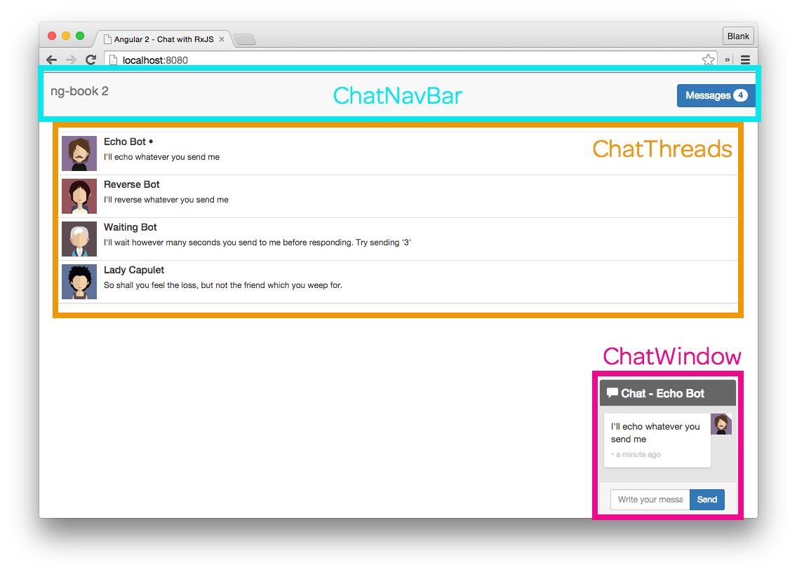
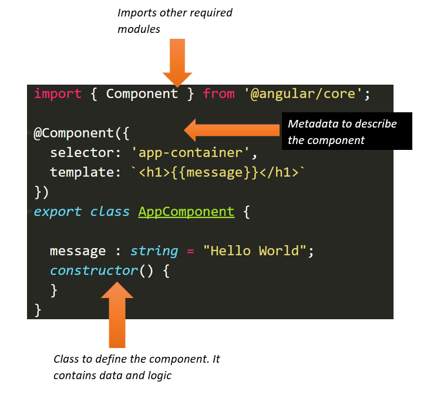
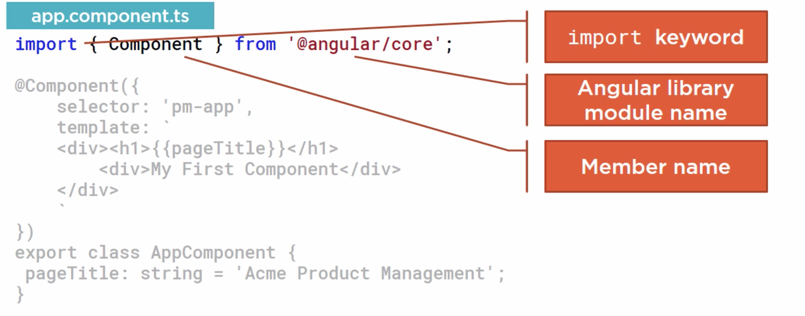
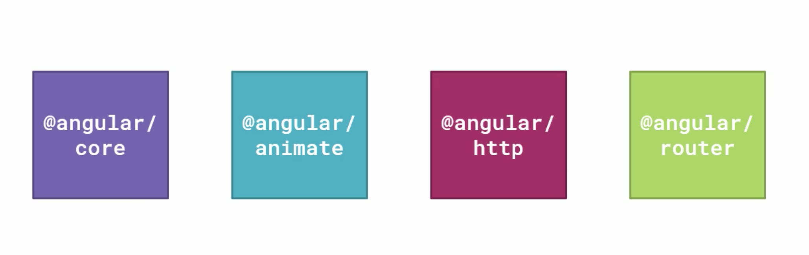
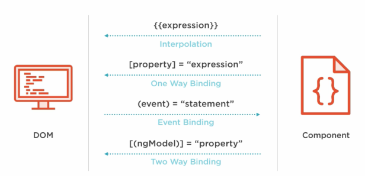
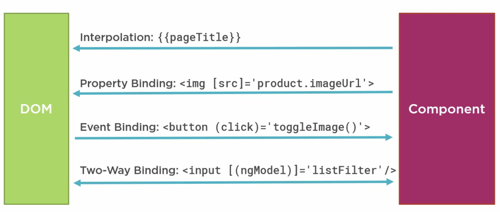
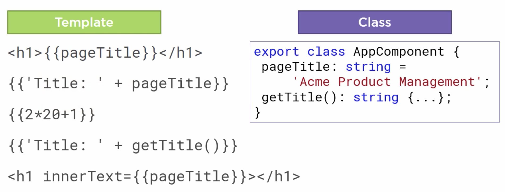
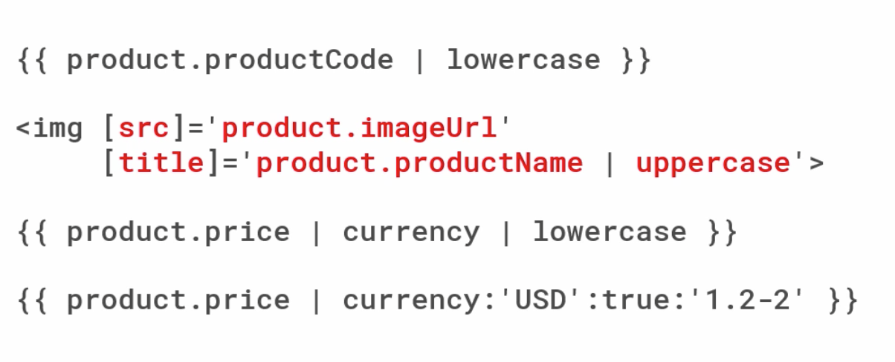
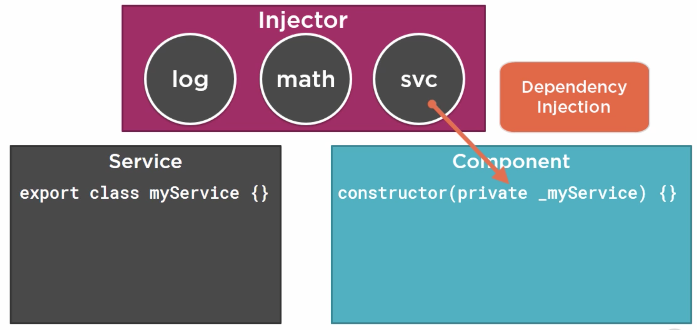
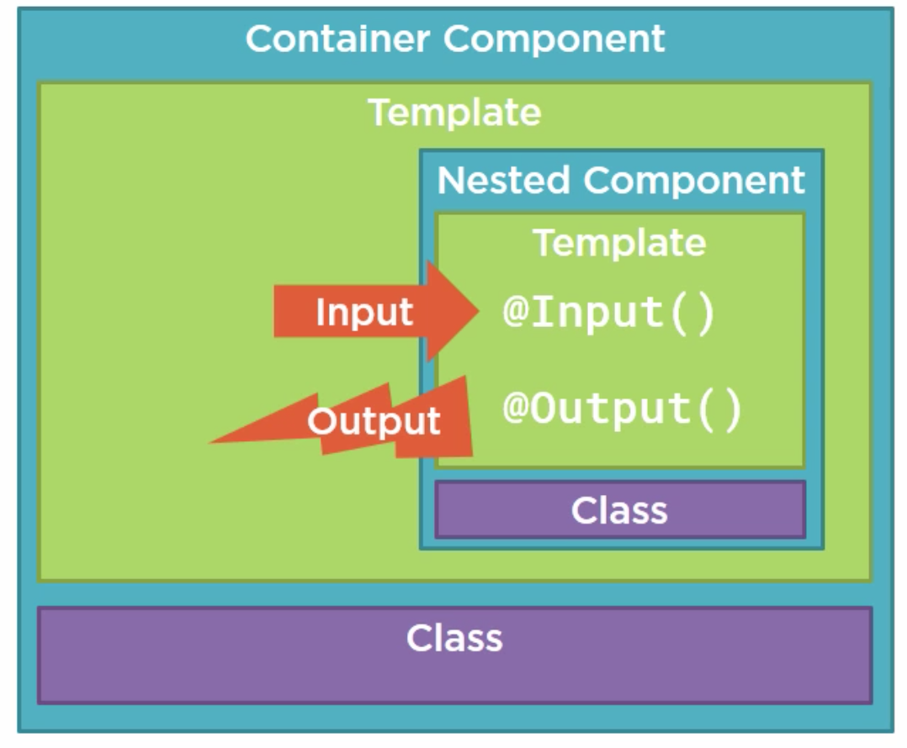

# Angular

## Repasamos el concepto de Componente

### Fundamentos de los componentes

Cada componente la idea es que funcione armoniosamente y en conjunto con el resto para proveer una experiencia de usuario única. Como dijimos, estos son modulares, resuelven un problema concreto y colaboran entre sí para lograr ir armando la interfaz de usuario como un puzzle donde cada pieza tiene sus diferentes responsabilidades.

Por ejemplo, una excelente forma de pensar los componentes es a través de la siguiente imagen:



A su vez, es interesante recordar cómo se comporta internamente cada componente. Como habíamos dicho, los componentes se componen de tres cosas:

1) **Template:** El **template** del componente, el cual define la estructura (HTML o la vista) del mismo. Se crea con código html y define lo que se renderizará en a página. A su vez incluye *bindings* y *directivas* para darle poder a nuestra vista y hacerla dinámica. Estos dos conceptos los veremos más adelante en este módulo

2) **Clase:** A su vez la view tiene un código asociado, el cual llamamos la **clase** de un componente. Esta representa el código asociado a la vista (creada con TypeScript), la cual posee los *datos*, llamadas las *properties* para que la vista los use (el nombre de una mascota por ejemplo), y a su vez posee la *lógica/funciones* que usan los mismos. Por ejemplo: la lógica para mostrar o esconder una imagen, la lógica para traer datos desde una Api, etc.

3) **Metadata:** Finalmente, el componente también tiene **metadata**, que es información adicional para Angular, siendo esta definida con un *decorator* (los que arrancan con **@**). Un decorador es una función que agrega metadata a una clase, sus miembros o los argumentos de sus métodos.


### La clase de un componente:

Para la clase de un componente, la sintaxis es como sigue a continuación:

```typescript
export class NombreComponent {
  property1: tipo = valor,
  property2: tipo2 = valor2,
  property3: tipo2 = valor3
  ...
}
```

Pero a su vez necesitamos utilizar el decorador ```Component```, el cual lo debemos importar desde ```@angular/core```:

```typescript
import { Component } from '@angular/core';

@Component({
  selector: 'nombre-component',
  template: `<h1>Hello {{property1}}</h1>`
})
export class NombreComponent {
  property1: tipo = valor,
  property2: tipo2 = valor2,
  property3: tipo2 = valor3
  ...
}
```

También podemos definir un constructor:

```typescript

export class NombreComponent {
  property1: string;
  property2: number;

  constructor(property1:string, property2: number) {
    this.property1 = property1
    this.property2 = property2;
  }
}

```

Algunos otros conceptos a tener en cuenta:

- Recordemos que por convención, el componente fundamental de una app de angular se llama AppComponent (el root component).
- La palabra reservada “export” simplemente hace que el componente se exporte y pueda ser visto por otros componentes de nuestra app.
- La sintaxis de definición del archivo es ```nombre.component.ts```.
- El valor por defecto en las properties de nuestros componentes es opcional.
- Los métodos vienen luego de las properties, en lowerCamelCase.

### El Template y la Metadata de un componente

Sin embargo, como ya sabemos, las clases de los componentes no son lo único necesario que precisamos para armar nuestra app en angular, precisamos darle el HTML, la vista, la UI. Todo eso y ms lo definimos a través del **metadata** del componente.

Una clase como la que definimos anteriormente se convierte en un componente de Angular cuando le definimos la metadata de componente.

Angular precisa de esa metadata para saber como instanciar el componente, estructurar la view, y ver la interacción:

- Usamos un decorator, siendo el scope de tal decorator la feature que decora.	Siempre son prefijos con un ```@```.
- Angular tiene un conjunto predefinido de decoradores que podemos usar, y hasta podemos crearnos los propios.
- El decorator va siempre antes de la definición de la clase, como las DataAnnotations en .NET (no va ;)
- Es una función y recibe un objeto que define el template.

En otras palabras el decorator ```@Component``` indica que la clase subyacente es un Componente de Angular y recibe la metadata del mismo (en forma de un objeto JSON de configuración). Aquí van algunas de las opciones de configuración más útiles para ```@Component```:

1) **selector**: Es un selector de CSS que le dice a Angular que cree e inserte una instancia de este componente en donde encuentre  un tag  ```<nombre-component>``` en su HTML padre. Por ejemplo, si el HTML  de una app contiene contains ```<nombre-component></nombre-component>```, entonces Angular inserta una instancia de la view asociada a ```NombreComponent``` entre esos dos tags.

Especifica el nombre de la directiva que vamos a usar con el componente. Es simplemente un tag HTML custom que vamos a poder usar.

2) **template**: Representa el código HTML asociado al componente y que debe ser mostrado cada vez que se use su selector. Es la UI para ese componente.

3) **templateUrl**: Similar al anterior pero permite referenciar a un documento HTML en lugar de tener que escribirlo directamente en el código del componente (puedo ponerlo en un archivo separado y tratarlo simplemente como un HTML.

4) **providers**: es un array de objeto de los providers de los servicios que el componente requiere para operar. Estos se inyectan a partir de inyección de dependencias; es simplemente una forma de decirle a Angular que el constructor del componente requiere algúns servicio para funcionar. Ejemplo:



## Importando o exportando módulos y componentes

Antes de usar una función o clase externa, tenemos que decirle al module de dónde lo puede sacar. Eso lo hacemos con el statement ```import```. Este statemente es parte de ES2015 y es implementado en TypeScript, funcionando como el import de java o el using de c#.

En consecuencia, nos permite usar todos los miembros que hayan sido exportados por algún ES Module (sea una librería de terceros, nuestros propios ES modules o modelos propios de Angular).



Esto se debe a que angular es modular, define una colección de módulos que engloban funcionalidad. Cuando precisemos algo de angular lo tomaremos de un angular module.



Para ver todos los módulos disponibles de angular:

www.npmjs.com/~angular 

Por ejemplo, en el código de nuestros componentes, decoramos los mismos con la función Component que viene dentro de angular core, para poder definir nuestra clase como nuestra component.

```typescript 
import  { Component } from ‘@angular/core’
```

Si queremos poner importar más de una clase desde dicho módulo, simplemente debemos separarlos por coma dentro de las llaves que.

## Data Binding e Interpolación

Como mencionamos anteriormente, queremos que cada componente tenga asociada una cierta vista (HTML), sin embargo, queremos que los datos que se muestran en la misma sean dinámicos, y que vengan desde las properties de la clase del componente. No queremos hardcodear el HTML que representa los datos a mostrar. Por ejemplo:

No queremos:

```html
<div class='panel-heading'>
    Nombre de la página que puede cambiar
</div>
```

Queremos:

```html
<div class='panel-heading'>
    {{pageTitle}}
</div>
```

```typescript
export class MyComponent {
  pageTitle: string = "Nombre de la página que puede cambiar"
  constructor(pageTitle : string)
  {
    this.pageTitle = pageTitle;
  }
}
```

Lo que se ve en el código anterior es el concepto de **Data Binding**, es decir, "el enlace" existente entre una porción de UI y ciertos datos de una clase de un componente. En otras palabras, estamos diciendole a la UI que mire el valor de la property ```pageTitle``` de la clase. Si dicha property cambia, entonces el valor mostrado por la UI cambia.
 
De manera que cuando el HTML se renderiza, el HTML muestra el valor asociado al modelo pageTitle.

El Data Binding va de la mano del concepto de **interpolación**, la cual es la habilidad de poner datos dentro de un HTML (interpolar). Esto es lo que logramos con las llaves dobles ``` {{ ... }} ```.



La interpolación no es el único tipo de Data Binding, también hay otros:

- **Property Binding**: cuando el binding es hacia una property particular y no  a una expresión compleja como puede ser la interpolación. Setea el valor de una property a un a expresíon en el template. Ver sintaxis en imagen de abajo.

- **Event Binding**: es binding hacia funciones o métodos que se ejecutan como consecuencia de eventos (por ejemplo: un click sobre un elemento).

- **Two-Way Binding**: Es un idea y vuelta entre el template y una property entre un component. Muestra el valor de la property en la vista, y si en la vista/template dicho valor cambia, la property también se ve reflejada (por eso es de dos caminos). Esto lo veremos  con ms detalle en el tutorial de más abajo.



## Directivas

A su vez, también podemos enriquecer nuestro HTML a partir de lo que se llaman **directivas**, pudiendo agregar **ifs** o **loops** (estilo for), sobre datos en nuestro HTML y generar contenido dinámicamente.

Una directiva es un elemento custom del HTML que usamos para extender o mejorar nuestro HTML. Cada vez que creamos un componente y queremos renderizar su template, lo hacemos a través de su *selector* asociado, el cual define la directiva del componente.

Pero a su vez angular también tiene algunas directivas built-in, sobre todo las *structural directives*. Por ejemplo: ***ngIf** o ***ngFor** (los asteriscos marcan a las directivas como que son estructurales).

## Usando Data Binding para mostrar datos dinmicos

Tenemos una pequeña tabla que muestra cosas, pero todavía no tiene ningún tipo de interacción, por lo que comenzaremos a explorar más a fondo las features del data binding que nos permiten manejar eventos y user input.

Ahora lo que queremos es ver poner contenido dinámico en nuestro componente. Para ello, repasemos el concepto de **Binding**. Este es el mecanismo que tiene Angular para coordinar los datos que existen en la clase de nuestro componente con su template, es decir en cómo se pasan los datos entre uno y otro.

La sintaxis del binding siempre se define en el template, a partir de lo que ya sabemos que se llama **interpolación**



La interpolación soporta mucho más que el mostrado properties simples, también permite realizar operaciones complejas o cálculos, o llamar métodos!

Hacer cambio en el  ```homeworks-list.component.html``` y poner:

```
 <div class='panel-heading'>
     {{pageTitle}}
 </div>
```


## Usando Pipes en Angular

Cuando los datos no están en el formato apropiado que queremos para mostrarlos, usamos Pipes. Estos permiten aplicar cierta lógica sobre las properties de nuestra clase antes de que estas sean mostradas (por ejemplo para que sean más user friendly). Angular ya provee varios Pipes built-in para diferentes tipos de datos (date, number, decimal,json, etc), e incluso permite crear pipes propios para realizar lógica particular como lo es manejar el filtrado. Esto lo haremos en la próxima clase.
Los pipes en general se denotan con el caracter ```|``` (pipe), expresión.
Por ahora, nos quedamos con pipes simples, como los de la imagen:



Para ello, simplemente cambiamos:
```html
<td>{{aHomework.description  | uppercase}}</td>
... // o
<td>{{aHomework.description  | lowercase}}</td>
```

##  Agregando Event Binding para los Exercises
Usaremos **Event Binding** para mandar información al revés de los tipos de Data Binding como la Interpolación o el Property Binding. En lugar de que el las properties de nuestra clase manden datos al template (o vista), esta vez será el template o vista quien se comunicará con la clase. Esto lo hace a partir de responder a eventos del usuario, por ejemplo un click, un mouse over, un copy o paste, un scroll, un tecleo, etc.
La información de eventos disponibles que podemos usar se encuentra bien documentada en:
https://developer.mozilla.org/en-US/docs/Web/Events
La idea es que nuestros componentes estén funcionando como "listeners" a las acciones del usuario, usando Event Binding, y pudiendo ejecutar cierta lógica particular.

La sintaxis es por ejemplo:
```html
<button (click)='hacerAlgoCuandoOcurreClick()'> </button>
```
- El nombre del evento va entre paréntesis.
- La lógica a ejecutar va entre comillas simples luego del igual.


## Custom Pipes: Filtrado en el listado de tareas

Como vimos la clase anterior (Clase 9), Angular provee un conjunto de Pipes que ya vienen integrados y que sirven para transformar los datos de nuestras bound properties antes de mostrarlos en el template (HTML). Ahora veremos como construir nuestros propios, Pipes personalizados, o *Custom Pipes*. 

El código necesario para crearlos seguramente a esta altura ya nos resulte familiar:

```typescript
import { Pipe, PipeTransform } from '@angular/core'; //0) importamos
import { Homework } from '../models/Homework';

//1) Nos creamos nuestra propia clase HomeworksFilterPipe y la decoramos con @Pipe
@Pipe({
  name: 'homeworksFilter'
})
export class HomeworksFilterPipe implements PipeTransform { //2) Implementamos la interfaz PipeTransform

  transform(list: Array<Homework>, arg: string): Array<Homework> { //3) Método de la interfaz a implementar
        //4) Escribimos el código para filtrar las tareas
        // El primer parametro 'list', es el valor que estamos transformando con el pipe (la lista de tareas)
        // El segundo parametro 'arg', es el criterio a utilizar para transfmar el valor (para filtrar las tareas)
        // Es decir, lo que ingresó el usuario
        // El retorno es la lista de tareas filtrada
  }
}
```

Como podemos ver, tenemos que crear una **clase**, y hacerla que implemente la interfaz **PipeTransform**. Dicha interfaz tiene un método **transform** que es el que será encargado de filtrar las tareas. A su vez decoramos la clase con un ```@Pipe``` que hace que nuestra clase sea un Pipe. Como notamos, la experiencia a la hora de programar en Angular es bastante consistente, esto es muy similar a cuando creamos componentes.
Tambien podemos lanzar el comando ```ng generate pipe "Nombre de la pipe"``` que nos da como resultado esto mismo.

Luego, para usar este CustomPipe en un template, debemos hacer algo así:

```html
<tr *ngFor='let homework of homeworks | HomeworksFilter:listFilter'> </tr>
```

Siendo:
- HomeworksFilter: el pipe que acabamos de crear.
- listFilter: el string por el cual estaremos filtrando.

Si quisieramos pasar más argumentos además del listFilter, los ponemos separados por ```:```.

También nos falta agregar el Pipe a nuestro módulo. Si queremos que el componente pueda usarlo, entonces debemos decirle a nuestro AppModule que registre a dicho Pipe. Siempre que queremos que un Componente use un Pipe, entonces el módulo del componente debe referenciar al Pipe. Lo haremos definiendo al Pipe en el array ```declarations``` del decorador ```ngModule``` de nuestro módulo.

Armemos el Pipe!

### 1) Creamos un archivo para el Pipe

Creamos en la carpeta ```app/homeworks-list```, un ``homeworks-filter.pipe.ts```, siguiendo nuestras convenciones de nombre.
O lanzamos ```ng generate pipe HomeworksFilter``` y movemos los archivos a la carpeta.

### 2) Agregamos la lógica del Pipe:

```typescript
import { Pipe, PipeTransform } from '@angular/core';
import { Homework } from '../models/Homework';

@Pipe({
  name: 'homeworksFilter'
})
export class HomeworksFilterPipe implements PipeTransform {

  transform(list: Array<Homework>, arg: string): Array<Homework> {
    return list.filter(
      x => x.description.toLocaleLowerCase()
        .includes(arg.toLocaleLowerCase())
    );
  }
}
```

### 3) Agregamos el filtrado en el template y sus estilos

Vamos a ```homeworks-list.component.html``` y donde usamos ```*ngFor```, agregamos el filtrado tal cual lo vimos arriba:

```html
<tr *ngFor="let aHomework of homeworks | homeworksFilter : listFilter">
```

### 4) Agregamos el Pipe a nuestro AppModule

Vamos a ```app.module.ts``` y agregamos el pipe:

```typescript
import { BrowserModule } from '@angular/platform-browser';
import { NgModule } from '@angular/core';
import { FormsModule } from '@angular/forms';

import { AppComponent } from './app.component';
import { HomeworksListComponent } from './homeworks-list/homeworks-list.component';
import { HomeworksFilterPipe } from './homeworks-list/homeworks-filter.pipe';
import { HomeworksService } from './services/homeworks.service';

@NgModule({
  declarations: [
    AppComponent,
    HomeworksListComponent,
    HomeworksFilterPipe
  ],
  imports: [
    FormsModule,
    BrowserModule
  ],
  providers: [
    HomeworksService
  ],
  bootstrap: [AppComponent]
})
export class AppModule { }
```
**Listo!** ya podemos filtar en nuestra lista!

## Servicios e Inyección de Dependencias

Los componentes nos permiten definir lógica y HTML para una cierta pantalla/vista en particular. Sin embargo, ¿qué hacemos con aquella lógica que no está asociada a una vista en concreto?, o ¿qué hacemos si queremos reusar lógica común a varios componentes (por ejemplo la lógica de conexión contra una API, lógica de manejo de la sesión/autenticación)?

Para lograr eso, construiremos **servicios**. Y a su vez, usaremos **inyección de dependencias** para poder meter/inyectar esos servicios en dichos componentes. 

Definiendo servicios, son simplemente clases con un fin en particular. Los usamos para aquellas features que son independientes de un componente en concreto, para reusar lógica o datos a través de componentes o para encapsular interacciones externas. Al cambiar esta responsabilidades y llevarlas a los servicios, nuestro código es más fácil de testear, debuggear y mantener.

Angular trae un ```Injector``` *built-in*, que nos permitirá registrar nuestros servicios en nuestros componentes, y que estos sean Singleton. Este Injector funciona en base a un contenedor de inyección de dependencias, donde una vez estos se registran, se mantiene una única instancia de cada uno.

Supongamos tenemos 3 servicios: svc, log y math. Una vez un componente utilice uno de dichos servicios en su constructor, el Angular Injector le provee la instancia del mismo al componente.



### Construyamos un servicio

Para armar nuestro servicio precisamos:
- Crear la clase del servicio.
- Definir la metadata con un @, es decir un decorador.
- Importar lo que precisamos.
¿Familiar? Son los mismos pasos que hemos seguido para construir nuestros componentes y nuestros custom pipes :)

### 1) Creamos nuestro servicio

Vamos a ```app/services``` y creamos un nuevo archivo: ```homeworks.service.ts```. 
O lanzamos ```ng generate service Homeworks``` y lo movemos a la carpeta

Luego, le pegamos el siguiente código:

```typescript
import { Injectable } from '@angular/core';
import { Homework } from '../models/Homework';
import { Exercise } from '../models/Exercise';

@Injectable()
export class HomeworksService {

  constructor() { }

  getHomeworks():Array<Homework> {
    return [
      new Homework('1', 'Una tarea', 0, new Date(), [
        new Exercise('1', 'Un problema', 1),
        new Exercise('2', 'otro problema', 10)
      ]),
      new Homework('2', 'Otra tarea', 0, new Date(), [])
    ];
  }
}
```

### 2) Registramos nuestro servicio a través de un provider

Para registrar nuestro servicio en nuestro componente, debemos registrar un Provider. Un provider es simplemente código que puede crear o retornar un servicio, **típicamente es la clase del servicio mismo**. Esto lo lograremos a través de definirlo en el componente, o como metadata en el Angular Module (AppModule).

- Si lo registramos en un componente, podemos inyectar el servicio en el componente y en todos sus hijos. 
- Si lo registramos en el módulo de la aplicación, lo podemos inyectar en toda la aplicación.

En este caso, lo registraremos en el Root Component (```AppModule```). Por ello, vamos a ```app.module.ts``` y reemplazamos todo el código para dejarlo así:

```typescript
import { BrowserModule } from '@angular/platform-browser';
import { NgModule } from '@angular/core';
import { FormsModule } from '@angular/forms';

import { AppComponent } from './app.component';
import { HomeworksListComponent } from './homeworks-list/homeworks-list.component';
import { HomeworksFilterPipe } from './homeworks-list/homeworks-filter.pipe';
import { HomeworksService } from './services/homeworks.service'; //importamos el servicio

@NgModule({
  declarations: [
    AppComponent,
    HomeworksListComponent,
    HomeworksFilterPipe
  ],
  imports: [
    FormsModule,
    BrowserModule
  ],
  providers: [
    HomeworksService //registramos el servicio para que este disponible en toda nuestra app
  ],
  bootstrap: [AppComponent]
})
export class AppModule { }

```

### 3) Inyectamos el servicio en nuestro HomeworksListComponent

La inyección la logramos a través del constructor de la clase, para ello hacemos en ```homeworks-list.component.ts```:

Primero el import:

```typescript
import { HomeworksService } from '../services/homeworks.service';
```
Y luego definimos el constructor que inyecta el servicio a la clase:
```typescript
constructor(private _serviceHomeworks:HomeworksService) { 
   // esta forma de escribir el parametro en el constructor lo que hace es:
   // 1) declara un parametro de tipo HomeworksService en el constructor
   // 2) declara un atributo de clase privado llamado _serviceHomeworks
   // 3) asigna el valor del parámetro al atributo de la clase
}
``` 

Eso el HomeworksService y lo deja disponible para la clase. Ahí mismo podríamos inicializar nuestras homeworks, llamando al ```getHomeworks``` del servicio, sin embargo, no es proljo mezclar la lógica de construcción del componente (todo lo que es renderización de la vista), con lo que es la lógica de obtención de datos. Para resover esto usarmoes Hooks particularmente, el ```OnInit``` que se ejecuta luego de inicializar el componente.

```typescript
ngOnInit(): void {
    this.homeworks = this._serviceHomeworks.getHomeworks();
}
```
Quedando, el código del componente algo así:
```typescript
import { Component, OnInit } from '@angular/core';
import { Homework } from '../models/Homework';
import { Exercise } from '../models/Exercise';
import { HomeworksService } from '../services/homeworks.service';

@Component({
  selector: 'app-homeworks-list',
  templateUrl: './homeworks-list.component.html',
  styleUrls: ['./homeworks-list.component.css']
})
export class HomeworksListComponent implements OnInit {
  pageTitle:string = 'HomeworksList';
  homeworks:Array<Homework>;
  showExercises:boolean = false;
  listFilter:string = "";

  constructor(private _serviceHomeworks:HomeworksService) { 
    
  }

  ngOnInit() {
    this.homeworks = this._serviceHomeworks.getHomeworks();
  }

  toogleExercises() {
    this.showExercises = !this.showExercises;
  }
}
```

## Componentes anidados o Nested components

Muchas veces nuestra aplicación va a tener features que son lo suficientemente complejas como para tratarlas de forma aislada, o donde existe una gran posibilidad de generar reuso en diferentes casos de uso, y por ende separarlas en componentes diferentes.
Veremos ahora como hacer componentes anidados o `Nested Componentes` y como generar interacción entre el componente **contenedor** y el componente **anidado**. Estos componentes van a mandar datos de un lado para el otro, usando inputs y mandando outputs al componente contenedor.

Hay dos formas de usar componentes anidados:

1) A traves de su directiva (como ya vimos en el index.html)
2) A traves de routing, indicandole a un componente que tiene que rutear a otro componente (lo veremos más adelante cuando demos routing). 

Por ahora usaremos la opción 1. El criterio que utilizaremos para indicar si un componente es 'anidable' o no, es simplemente a partir de **evaluar si su template maneja una parte de una view más grande, y obviamente si tiene un selector y una forma de comunicación con su contenedor**.



Supongamos que nuestras Tareas de nuesta API tienen una popularidad asociada. Creemos ahora un nested component que lo que haga es mostrar estrellitas por cada tarea que tengamos. Lo que queremos hacer es que el mostrado de estrellitas sea un componente aparte, que maneje su propia interacción tanto de inputs de sus componentes contenedores, como de outputs hacia otros componentes.

### 1) Creamos los archivos para nuestro StarComponent

En primer lugar, creamos nuesto componente con el commando: ```ng generate component Star```

### 2) Creamos el StarComponent 

Dentro de ```star.component.ts```, pegamos el siguiente código:

```typescript
import { Component, OnChanges } from '@angular/core';

@Component({
  selector: 'app-star',
  templateUrl: './star.component.html',
  styleUrls: ['./star.component.css']
})
export class StarComponent implements OnChanges {
    
    rating: number = 4; //hardcodeamos un valor por defecto para ver algo
    starWidth: number;

    ngOnChanges():void {
        //86 es el width de nuestras estrellitas (ver el template)
        //como estamos implementando el OnChanges, cada vez que el valor de 'rating' cambie
        //esto se va a refrescar
        this.starWidth = this.rating * 86/5; 
    }
}
```

### 3) Creamos el Template para nuestro StarComponent y sus estilos

Dentro de ```star.component.html```, pegamos el siguiente código:

```html
<div clas="crop"
    [style.width.px]="starWidht"
    [title]="rating">
    <div style="width:86px">
        <span class="glyphicon glyphicon-star"></span>
        <span class="glyphicon glyphicon-star"></span>
        <span class="glyphicon glyphicon-star"></span>
        <span class="glyphicon glyphicon-star"></span>
        <span class="glyphicon glyphicon-star"></span>
    </div>
</div>
```

A su vez, vamos a ```star.component.css```, y pegamos el siguiente código:

```css
.crop {
    overflow: hidden;
}

div {
    cursor: pointer;
}
```

### 4) Agregamos el StarComponent al AppModule si no se importo automaticamente.

Dentro de ```app.module.ts```, reemplazamos lo que hay y pegamos el siguiente código:

```typescript
import { BrowserModule } from '@angular/platform-browser';
import { NgModule } from '@angular/core';
import { FormsModule } from '@angular/forms';

import { AppComponent } from './app.component';
import { HomeworksListComponent } from './homeworks-list/homeworks-list.component';
import { HomeworksFilterPipe } from './homeworks-list/homeworks-filter.pipe';
import { HomeworksService } from './services/homeworks.service';
import { StarComponent } from './star/star.component'; //importamos el starcomponent

@NgModule({
  declarations: [
    AppComponent,
    HomeworksListComponent,
    HomeworksFilterPipe,
    StarComponent  //agregamos a las declarations
  ],
  imports: [
    FormsModule,
    BrowserModule
  ],
  providers: [
    HomeworksService
  ],
  bootstrap: [AppComponent]
})
export class AppModule { }
```

### 5) Usamos el StarComponent dentro de HomeworksListComponent

En el template de nuestro componente de listado de tareas, es decir dentro de ``homeworks-list.component.html```, agregamos:
Dentro del header de la tabla, es decir, en el tag ```thead```, agregamos esta última celda:
```html
<th>Rating</th>
```
Dentro del body de la tabla, es decir, en el tag ```tbody```, y dentro del ```*ngFor``` sobre las rows, agregamos esta última celda:
```html
<td> 
   <app-star></app-star>
</td>
```

### 6) Usando input properties

Vemos que se muestran 5 estrellas y no 4 como habíamos hardcodeado. Ni que tampoco se modifica el valor en el OnChanges (esto es porque el OnChanges se cambia cuando alguna input property de un componente se refresca). Veamos esto:

Si un Nested Component quiere recibir inputs de su componente contenedor, debe exponer properties a partir del decorador ```@Input```. En consecuencia, cada property deberamos decorarla con tal decorador. Luego, el componente contenedor, deberá encargarse  de setearle dicha property al componente anidado a partir de property binding en el template con paréntesis rectos:
```typescript
<td> 
    <app-star [rating]='aHomework.rating'></app-star>
</td>
```

Para hacer lo de arriba precisamos:
- Ir a ```app/models/homework.ts``` y agregar la property rating
- Ir a ```app/homeworks-list/homeworks-list.component.ts``` y agregar un valor de rating en las tareas que tengamos creadas.
Esto no se describe aquí pero se puede observar en el código fuente.
Lo que haremos es ir al HTML del template y cambiar lo que teníamos antes por lo que acabamos de ver arriba.

### 7) Definimos la Input Property Rating en StarComponent

Para ello precisamos importar Input:
```typescript
import { Component, OnChanges, Input } from '@angular/core';
```
Y luego agregar el decorador a la property ```rating```:
```typescript
@Input() rating: number;
```

### 8) Levantando eventos desde un componente anidado

Si queremos que nuestro StarComponent se comunique con su contenedor HomeworksListComponent, debemos usar eventos. Para ello tenemos que usar, para definirlos, el decorator ```@Output```, el cual debemos aplicar sobre la property del componente anidado que queremos usar (es importante notar que el tipo de dicha property debe ser un ```EventEmitter```, la única forma de pasar datos a su contenedor). A su vez, dicha clase se basa en generics para especificar el tipo de datos de lo que queremos pasar al componente contenedor.

La forma que usaremos para activar el evento, es a partir del método click sobre las estrellas; una vez que se haga el click, se activará la lógica que definamos del evento.

La sintaxis para activar al evento desde nuestros componentes anidados es:
onClick() {
    this.nombreDelEvento.emit('parametro a pasar al contenedor');
}
Siendo ```emit``` lo que usamos para levantar el evento al contenedor.
Vayamos al código:
Lo primero que hacemos es importar ```EventEmitter``` y ```Output``` en nuestro ```StarComponent```:
```typescript
import { Component, OnChanges, Input, Output, EventEmitter } from '@angular/core';
```
Luego definimos la property del evento en nuestra clase del StarComponent:
```typescript
@Output() ratingClicked: EventEmitter<string> = new EventEmitter<string>();
```
Luego hacemos el binding del evento en el template del evento:
```html
<div class="crop" 
    [style.width.px]="starWidth"
    title={{starWidth}}
    (click)='onClick()'>
    <div style="width: 86px">
        <span class="glyphicon glyphicon-star"></span>
        <span class="glyphicon glyphicon-star"></span>
        <span class="glyphicon glyphicon-star"></span>
        <span class="glyphicon glyphicon-star"></span>
        <span class="glyphicon glyphicon-star"></span>
    </div>
</div>
```
Y ahora volvemos al StarComponent y agregamos la funcion onClick que acabamos de declarar en nuestro template:
```typescript
onClick(): void {
    this.ratingClicked.emit(`El raiting es ${this.rating}!`);
}
```
Finalmente, lo que haremos es agregar es la referencia al evento en el template:
```html
<app-star [rating]='aHomework.rating'
    (ratingClicked)='onRatingClicked($event)'>
</app-star>
```
Y dentro del código del HomeworksListComponent definimos el callback que queremos que se ejecute cuando se haga click en nuestras estrellas:
```typescript
onRatingClicked(message:string):void {
    this.pageTitle = 'HomeworksList ' + message;
}
```
