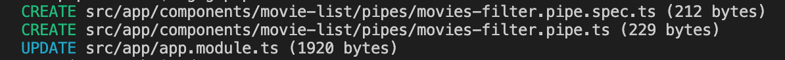
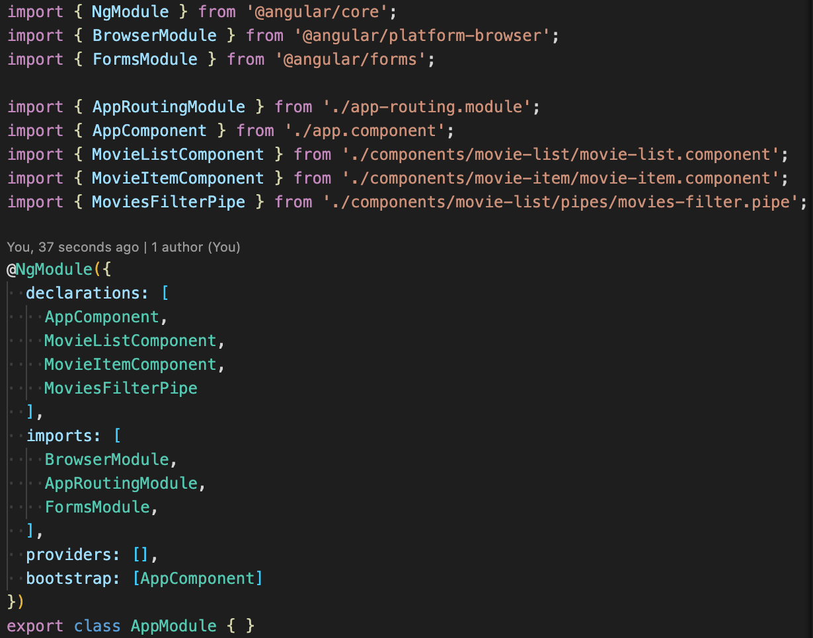
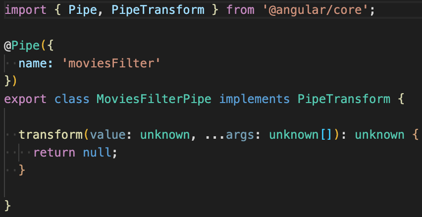
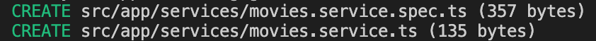
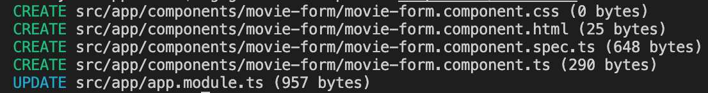
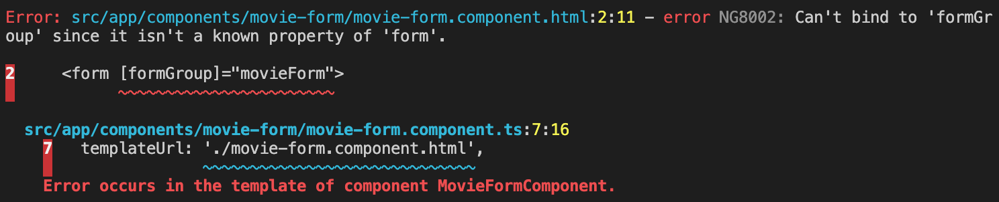

# Custom Pipes y Service Básico

## Custom Pipes: Filtrado en el listado de tareas

Como vimos la clase anterior, Angular ya provee un conjunto de Pipes que vienen integrados y que sirven para transformar los datos de nuestras properties antes de mostrarlos en el template (HTML). Ahora vamos a ver como construir nuestros propios Pipes personalizados, o *Custom Pipes*.

Vamos a hacer un custom pipe para poder transformar nuestra lista de películas, para poder filtrar las películas por lo que el usuario escriba en el input de filtro.
Como es un filtro que solamente voy a utilizar para la lista de películas, me voy a crear una carpeta adentro de movie-list que se llame pipes.

Voy a ejecutar ```ng generate pipe components/movie-list/pipes/MoviesFilter```, siendo MoviesFilter el nombre del pipe. Este comando me va a crear el pipe en la carpeta pipes adentro del componente **movie-list**. Como van a ver, crea 2 archivos. El archivo de test y el pipe. Además hace un update en el **AppModule**.



Si vamos al AppModule ahora tenemos en las **declarations** el **MoviesFilterPipe**.



Ahora vamos a la clase del pipe. Vemos que es una **clase** anotada con el decorator ```@Pipe``` que recibe una configuración en formato JSON en la que se le especifica el name de ese pipe, el name con el que lo vamos a llamar. Esta **clase** implementa la interfaz **PipeTransform** que nos hace definir un método **transform** que es el que va a tener la lógica para transformar nuestra lista de películas.



Vamos a acomodar los types de los parámetros y el type de la salida y vamos a agregar la lógica.
Lo que voy a estar recibiendo es mi lista de películas movies: Movie[] | undefined y **NO voy a recibir una lista de argumentos en este caso**, si no que voy a recibir un filter de tipo string (filter: string)

El código de nuestro filtro nos quedaría algo así:

```typescript
import { Pipe, PipeTransform } from '@angular/core';  // 1) imports
import { Movie } from '../../../models/movie';

// 2) Nos creamos nuestra propia clase MoviesFilterPipe y la decoramos con el decorator @Pipe
@Pipe({
  name: 'moviesFilter'
})
export class MoviesFilterPipe implements PipeTransform { // 3) Implementamos la interfaz PipeTransform

  // 4) Implementamos el método transform de la interfaz PipeTransform
  transform(movies: Movie[] | undefined, filterValue: string): Movie[] {
    // 5) Escribimos el código para filtrar las películas
    // El primer parámetro (movies) es la lista de películas que vamos a transformar
    // El segundo parámetro (filterValue) es el criterio que vamos a utilizar para transformar
    // en este caso vamos a estar filtrando las películas por ese filterValue
    // El retorno es la lista de películas filtradas por filterValue
    if(!movies) {
      return [];
    }
    return movies.filter((movie) => movie.name.toLowerCase().includes(filterValue.toLowerCase()));
  }
}
```

Vamos usar este CustomPipe en nuestro ```movie-list.component.html```. El código nos quedaría algo así:

```html
<div class="movie-list-container">
    <h2 class="title">Películas</h2>
    <div class="movie-header">
      <input class="filter-input" [(ngModel)]="filterValue" placeholder="Filtrar por" />
    </div>
    <p class="filter" *ngIf="filterValue">
      Películas filtradas por <b>{{ filterValue }}</b>
    </p>
    <div class="list" *ngIf="movies && (movies | moviesFilter: filterValue).length > 0; else elseBlock">
      <app-movie-item
        *ngFor="let movie of movies | moviesFilter: filterValue"
        [movie]="movie"
        (delete)="deleteMovie($event)"
      >
      </app-movie-item>
    </div>
    <ng-template #elseBlock>
      <p class="no-movies-message">No hay películas</p>
    </ng-template>
</div>
```

Siendo:
- moviesFilter: el pipe que acabamos de crear.
- filterValue: el string por el cual estaremos filtrando.

Si quisieramos pasar más argumentos además del filterValue, los ponemos separados por ```:```.

Cómo ven cambió tanto el **ngFor** como el **ngIf** del div.

Por qué cambié mi **ngIf**? Porque ahora mi lista de películas que estoy recorriendo en mi **ngFor** no es más movies, si no el resultado de hacer ```movies | moviesFilter: filterValue```

### **IMPORTANTE**

Si queremos que el componente pueda usar el Pipe, debemos declararlo en nuestro AppModule. Siempre que queramos que un Componente use un Pipe, el módulo en el que declaramos ese componente debe referenciar al Pipe. En este caso lo hicimos definiendo el Pipe en el array ```declarations``` del decorador ```ngModule``` de nuestro módulo.

## Servicios e Inyección de Dependencias

Los componentes nos permiten definir lógica y HTML para una cierta pantalla/vista en particular. Sin embargo, ¿qué hacemos con aquella lógica que no está asociada a una vista en concreto?, o ¿qué hacemos si queremos reusar lógica común a varios componentes (por ejemplo la lógica de conexión contra una API, lógica de manejo de la sesión/autenticación)?

Para lograr eso, construiremos **servicios**. Y a su vez, usaremos **inyección de dependencias** para poder inyectar esos servicios en dichos componentes.

Definiendo servicios, son simplemente clases con un fin en particular. Los usamos para aquellas features que son independientes de un componente en concreto, para reusar lógica o datos a través de componentes o para encapsular interacciones externas. Al cambiar estas responsabilidades y llevarlas a los servicios, nuestro código es más fácil de testear, debuggear y mantener.

Angular trae un ```Injector``` *built-in*, que nos permitirá registrar nuestros servicios en nuestros componentes, y que estos sean Singleton. Este Injector funciona en base a un contenedor de inyección de dependencias, donde una vez estos se registran, se mantiene una única instancia de cada uno.

Supongamos tenemos 3 servicios: svc, log y math. Una vez un componente utilice uno de dichos servicios en su constructor, el Angular Injector le provee la instancia del mismo al componente.


### Construyamos un servicio

Para armar nuestro servicio precisamos:
- Crear la clase del servicio.
- Definir la metadata con un @, es decir un decorador.
- Importar lo que precisamos.
¿Familiar? Son los mismos pasos que hemos seguido para construir nuestros componentes y nuestros custom pipes :)

### 1) Creamos nuestro servicio

Vamos a ```src/app/services``` y creamos un nuevo archivo: ```movies.service.ts```. 
O en la terminal y ejecutamos ```ng generate service services/Movies``` (esto nos crea la carpeta services y dos archivos: el de test y el la clase del servicio)



### **IMPORTANTE**
No se olviden de registrar el servicio como **provider** en nuestro **módulo**, en este caso en el AppModule. Esto lo vamos a hacer más adelante.

En la clase de nuestro servicio vamos a pegar el siguiente código:

```typescript
import { Injectable } from '@angular/core';
import { ICreateMovie } from '../interfaces/create-movie.interface';
import { Movie } from '../models/movie';

@Injectable({
  providedIn: 'root'
})
export class MoviesService {

  private _movies: Movie[] | undefined;
  constructor() { 
    this._movies = this.initializeMovies();
  }

  public getMovies(): Movie[] {
    return this._movies ?? [];
  }

  public getMovieById(id: number): Movie | undefined {
    return this._movies?.find((movie) => movie.id.toString() === id?.toString());
  }

  public postMovie(movieToAddDto: ICreateMovie): number {
    if(!this._movies) this._movies = [];
    const max = Math.max(...this._movies.map(movie => movie?.id));
    const id = max + 1;
    const movieToAdd = new Movie(id, movieToAddDto.name, movieToAddDto.category,
      movieToAddDto.director, movieToAddDto.country, movieToAddDto.year, movieToAddDto.rating);
    this._movies.push(movieToAdd);
    return id;
  }

  public putMovie(movieToUpdate: Movie): Movie | undefined {
    this._movies = this._movies?.map(movie => {
      if(movie.id === movieToUpdate.id) {
        return {
          ...movie,
          name: movieToUpdate.name,
          category: movieToUpdate.category,
          director: movieToUpdate.director,
          country: movieToUpdate.country,
          year: movieToUpdate.year,
          rating: movieToUpdate.rating,
        };
      }
      return movie;
    });
    return this._movies?.find((movie) => movie.id === movieToUpdate.id);
  }

  public deleteMovie(movieId: number): boolean {
    const movie = this._movies?.find(movie => movie.id === movieId);
    if(!!movie) {
      this._movies = this._movies?.filter(movie => movie.id !== movieId);
      return true;
    }
    return false;
  }

  private initializeMovies(): Movie[] {
    return [
      new Movie(1, "La Era de Hielo", "Animada", "Chris Wedge y Carlos Saldanha", "Estados Unidos", 2002, 5),
      new Movie(2, "El Aro", "Terror", "Gore Verbinski", "Estados Unidos", 2002, 4),
      new Movie(3, "Rápido y Furioso", "Acción", "Rob Cohen", "Estados Unidos", 2001, 3),
      new Movie(4, "Joker", "Suspenso", "Todd Phillips", "Estados Unidos", 2019, 4),
      new Movie(5, "Bajocero", "Suspenso", "Lluís Quílez", "España", 2021, 2),
    ];
  }
}
```

Para que nos compile el servicio vamos a crear la interfaz ```ICreateMovie``` que cree para que reciba mi postMovie.

En la carpeta ```src/app``` me voy a crear una carpeta ```interfaces``` y ahí voy a crear un archivo ```create-movie.interface.ts``` y le voy a pegar este código:

```typescript
export interface ICreateMovie {
    name: string;
    category: string;
    director: string;
    country: string;
    year: number;
    rating: number;
}
```

El servicio tiene básicamente el CRUD de movies que vamos a estar utilizando, simulando un servicio real. Lo vamos a estar utilizando mientras tanto antes de que veamos como conectarnos con la API.

### 2) Registramos nuestro servicio a través de un provider

Para registrar nuestro servicio en nuestro componente, debemos registrar un Provider. Un provider es simplemente código que puede crear o retornar un servicio, **típicamente es la clase del servicio mismo**. Esto lo lograremos a través de definirlo en el componente, o como metadata en el Angular Module (AppModule).

- Si lo registramos en un componente, podemos inyectar el servicio en el componente y en todos sus hijos. 
- Si lo registramos en el módulo de la aplicación, lo podemos inyectar en toda la aplicación.

En este caso, lo registraremos en el Root Module (```AppModule```). Por ello, vamos a ```app.module.ts``` y reemplazamos todo el código para dejarlo así:

```typescript
import { NgModule } from '@angular/core';
import { BrowserModule } from '@angular/platform-browser';
import { FormsModule } from '@angular/forms';

import { AppRoutingModule } from './app-routing.module';
import { AppComponent } from './app.component';
import { MovieListComponent } from './components/movie-list/movie-list.component';
import { MovieItemComponent } from './components/movie-item/movie-item.component';
import { MoviesFilterPipe } from './components/movie-list/pipes/movies-filter.pipe';
import { MoviesService } from './services/movies.service';

@NgModule({
  declarations: [
    AppComponent,
    MovieListComponent,
    MovieItemComponent,
    MoviesFilterPipe
  ],
  imports: [
    BrowserModule,
    AppRoutingModule,
    FormsModule,
  ],
  providers: [MoviesService],
  bootstrap: [AppComponent]
})
export class AppModule { }
```

### 3) Inyectamos el servicio en nuestro MovieListComponent

La inyección la logramos a través del constructor de la clase, para ello hacemos en ```movie-list.component.ts```:

Primero el import:

```typescript
import { MoviesService } from '../../services/movies.service';
```
Y luego definimos el constructor que inyecta el servicio a la clase:
```typescript
constructor(private _moviesService: MoviesService) {
    // esta forma de escribir el parámetro en el constructor lo que hace es:
    // 1) declara un parámetro de tipo MoviesService en el constructor
    // 2) declara un atributo de clase privado llamado _moviesService
    // 3) asigna el valor del parámetro al atributo de la clase
}
``` 

Así inyectamos el ```MoviesService``` y lo dejamos disponible para la clase. Ahí mismo podríamos inicializar nuestra lista de películas, llamando al ```getMovies``` del servicio. Sin embargo, no es proljo mezclar la lógica de construcción del componente (todo lo que es renderización de la vista), con lo que es la lógica de obtención de datos. Para resover esto usaremos Hooks particularmente, el ```OnInit``` que se ejecuta luego de inicializar el componente.

Acá pueden aprender más sobre hooks: https://angular.io/guide/lifecycle-hooks

```typescript
public ngOnInit(): void {
    // cuando inicia el componente llamo al servicio para obtener las películas
    this.movies = this._moviesService.getMovies();
}
```
También tengo que actualizar mi ```deleteMovie``` para que no borre sobre la lista de películas que tengo en mi componente, si no que llame al ```servicio``` para borrarla.

Nuestro ```deleteMovie``` quedaría de la siguiente manera:

```typescript
public deleteMovie(movieToDelete: Movie): void {
    // voy a borrar la película
    const deleted = this._moviesService.deleteMovie(movieToDelete?.id);
    if(deleted) { // si se borró correctamente actualizo la lista de películas
      this.movies = this._moviesService.getMovies();
    }
}
```

**Por qué hago el ```getMovies``` nuevamente?** Porque al llamar al servicio estoy borrando sobre la colección de movies del servicio (y más adelante haremos la request a la API) y necesito actualizar la colección de movies que tiene mi componente. Para esto consulto al servicio que es ```My Source of Truth``` (más adelante tendría que consultar a la API)

El código completo del componente quedaría algo así:
```typescript
import { Component, OnInit } from '@angular/core';
import { MoviesService } from '../../services/movies.service';
import { Movie } from '../../models/movie';

@Component({
  selector: 'app-movie-list',
  templateUrl: './movie-list.component.html',
  styleUrls: ['./movie-list.component.css']
})
export class MovieListComponent implements OnInit {

  public filterValue: string = '';
  public movies: Movie[] = [];

  constructor(
    private _moviesService: MoviesService,
  ) { }

  public ngOnInit(): void {
    // cuando inicia el componente llamo al servicio para obtener las películas
    this.movies = this._moviesService.getMovies();
  }

  public deleteMovie(movieToDelete: Movie): void {
    // voy a borrar la película
    const deleted = this._moviesService.deleteMovie(movieToDelete?.id);
    if(deleted) { // si se borró correctamente actualizo la lista de películas
      this.movies = this._moviesService.getMovies();
    }
  }
}
```

## **Navegación entre componentes, Router, Activated Route, Observables, reutilización de componentes, Formulario, FormControls y validación de Formularios**

Ejecutamos ```ng generate component components/MovieForm``` para que nos cree el componente ```MovieForm``` en la carpeta ```components```

Nos crea 4 archivos y actualiza el AppModule, agregando el ```MovieFormComponent``` a la lista de ```declarations``` del ```AppModule```:



Vamos a ```src/app/components/movie-form``` y entramos a nuestro ```movie-form-component.ts```

Para nuestro ```Form``` vamos a utilizar ```FormGroup``` que nos va a ayudar a agrupar los inputs del formulario y mantener el **estado de validación** del mismo. El ```FormGroup``` va a recibir una colección de ```FormControl``` de la siguiente manera:

```typescript
{
    [key: string]: new FormControl('initialValue', [Validators]),
}
```

```key``` va a ser el identificador del ```FormControl``` y ```[Validators]``` la lista de validadores.

Para este ejemplo vamos a utilizar ```Validators.required``` porque todos nuestros inputs van a ser ```required``` y vamos a ver cómo crear nuestros propios ```Validators```.

Por poner un ejemplo, algo que podríamos querer validar es que en los campos de texto el usuario no ingrese solo espacios.

Para esto creamos una carpeta ```validators``` en ```src/app/validators```. Creamos un archivo con nombre ```string.validator.ts``` y vamos a colocar el siguiente código:

```typescript
import { AbstractControl } from '@angular/forms';

export function ValidateString(control: AbstractControl): { invalidString: boolean } | null {
  if (control.value?.trim()?.length === 0) {
    return { invalidString: true };
  }
  return null;
}
```
El ```Validator``` simplemente es una función que recibe el control y va a retornar una objeto con una ```key``` y ```true``` en caso de que no sea válido.
Para acceder al ```valor``` del ```control``` hacemos control.value, para sacarle los espacios usamos la función ```trim()``` y si el texto resultante de haberle aplicado la función ```trim``` queda de largo 0, entonces decimos que es inválido, retornando el objeto con ```key``` **invalidString**. De esta forma **```Angular```** nos coloca en el objeto ```errors```, el objeto que le acabamos de retornar. Es por eso que en el caso en el que sea válido no retornamos un objeto si no que retornamos ```null```.

Volvamos a nuestro ```movie-form-component.ts```. Vamos a crear ahora nuestro ```FormGroup```. El código nos quedaría de la siguiente manera:

```typescript
public actualYear = new Date().getFullYear();

public movieForm = new FormGroup({
    name: new FormControl('', [Validators.required, ValidateString]),
    category: new FormControl('', [Validators.required, ValidateString]),
    director: new FormControl('', [Validators.required, ValidateString]),
    country: new FormControl('', [Validators.required, ValidateString]),
    year: new FormControl(undefined, [Validators.required, Validators.min(1970), Validators.max(this.actualYear)]),
    rating: new FormControl(undefined, [Validators.required, Validators.min(1), Validators.max(5)]),
});
```

Y estos son los imports que necesitamos hacer:

```typescript
import { FormControl, FormGroup, Validators } from '@angular/forms';
import { ValidateString } from '../../validators/string.validator';
```

```actualYear``` es una variable que tiene el año actual para poder utilizarlo al validar el valor máximo que puede tomar nuestro ```year```.

Lo siguiente que vemos es nuestro ```movieForm``` que es un ```FormGroup``` que recibe un objeto con todos nuestros ```controls``` que van a ser ```FormControl```. A cada uno le asignamos una ```key``` para identificarlo dentro del ```FormGroup```. Cada ```FormControl``` va a recibir como primer parámetro, el valor inicial. En este caso vamos a inicializar cada input como ```undefined```, es decir, no definido. El segundo parámetro que recibe el ```FormControl``` es la lista de ```Validators```. En el caso de los inputs de tipo ```text``` vamos a utilizar los validators: 
```typescript
[Validators.required, ValidateString]
```

En el caso de los inputs de tipo ```number``` ademas del ```validator Validators.required``` vamos a utilizar los ```Validators.min()``` y ```Validators.max()``` para especificar el rango válido.

Para mostrar los errores en nuestra vista, vamos a necesitar acceder a los controls de cada input. Para esto nos vamos a crear los get correspondientes:

```typescript
public get name() { return this.movieForm.get('name'); }

public get category() { return this.movieForm.get('category'); }

public get director() { return this.movieForm.get('director'); }

public get country() { return this.movieForm.get('country'); }

public get year() { return this.movieForm.get('year'); }

public get rating() { return this.movieForm.get('rating'); }
```

Lo otro que necesitamos es una función para cuando el usuario submitee el ```form```.
Por ahora en la función vamos a poner unos logs para ver qué nos llega.

El código de la función nos quedaría así:

```typescript
public createMovie(): void {
    console.log(this.movieForm);
    console.log({valid: this.movieForm.valid});
    console.log({
      name: this.movieForm.value.name,
      category: this.movieForm.value.category,
      director: this.movieForm.value.director,
      country: this.movieForm.value.country,
      year: this.movieForm.value.year,
      rating: this.movieForm.value.rating,
    });
}
```

El código del componente hasta ahora sería:

```typescript
import { Component, OnInit } from '@angular/core';
import { FormControl, FormGroup, Validators } from '@angular/forms';
import { ValidateString } from '../../validators/string.validator';

@Component({
  selector: 'app-movie-form',
  templateUrl: './movie-form.component.html',
  styleUrls: ['./movie-form.component.css']
})
export class MovieFormComponent implements OnInit {

  public actualYear = new Date().getFullYear();

  public movieForm = new FormGroup({
    name: new FormControl(undefined, [Validators.required, ValidateString]),
    category: new FormControl(undefined, [Validators.required, ValidateString]),
    director: new FormControl(undefined, [Validators.required, ValidateString]),
    country: new FormControl(undefined, [Validators.required, ValidateString]),
    year: new FormControl(undefined, [Validators.required, Validators.min(1970), Validators.max(this.actualYear)]),
    rating: new FormControl(undefined, [Validators.required, Validators.min(1), Validators.max(5)]),
  });

  constructor() { }

  public get name() { return this.movieForm.get('name'); }

  public get category() { return this.movieForm.get('category'); }

  public get director() { return this.movieForm.get('director'); }

  public get country() { return this.movieForm.get('country'); }

  public get year() { return this.movieForm.get('year'); }

  public get rating() { return this.movieForm.get('rating'); }

  public ngOnInit(): void {
  }

  public createMovie(): void {
    console.log(this.movieForm);
    console.log({valid: this.movieForm.valid});
    console.log({
      name: this.movieForm.value.name,
      category: this.movieForm.value.category,
      director: this.movieForm.value.director,
      country: this.movieForm.value.country,
      year: this.movieForm.value.year,
      rating: this.movieForm.value.rating,
    });
  }
}
```

Vamos a agregar el html a nuestro ```movie-list.component.html```.

Este es el HTML:

```html
<div class="form">
    <form [formGroup]="movieForm">
        <div class="form-item">
            <div class="form-item-control">
                <label class="form-item-label" for="name">Nombre</label>
                <input class="form-item-input" formControlName="name" id="name"
                [ngClass]="{ 'input-error': name?.invalid && (name?.dirty || name?.touched) }" />
            </div>
            <div *ngIf="name?.invalid && (name?.dirty || name?.touched)" class="alert-danger">
                <div *ngIf="name?.errors?.['required'] || name?.errors?.['invalidString']">
                    Debe ingresar un nombre.
                </div>
            </div>
        </div>
        <div class="form-item">
            <div class="form-item-control">
                <label class="form-item-label" for="category">Categoría</label>
                <input class="form-item-input" formControlName="category" id="category"
                [ngClass]="{ 'input-error': category?.invalid && (category?.dirty || category?.touched) }" />
            </div>
            <div *ngIf="category?.invalid && (category?.dirty || category?.touched)" class="alert-danger">
                <div *ngIf="category?.errors?.['required'] || category?.errors?.['invalidString']">
                    Debe ingresar una categoría.
                </div>
            </div>
        </div>
        <div class="form-item">
            <div class="form-item-control">
                <label class="form-item-label" for="director">Director</label>
                <input class="form-item-input" formControlName="director" id="director"
                [ngClass]="{ 'input-error': director?.invalid && (director?.dirty || director?.touched) }" />
            </div>
            <div *ngIf="director?.invalid && (director?.dirty || director?.touched)" class="alert-danger">
                <div *ngIf="director?.errors?.['required'] || director?.errors?.['invalidString']">
                    Debe ingresar un director.
                </div>
            </div>
        </div>
        <div class="form-item">
            <div class="form-item-control">
                <label class="form-item-label" for="country">País</label>
                <input class="form-item-input" formControlName="country" id="country"
                [ngClass]="{ 'input-error': country?.invalid && (country?.dirty || country?.touched) }" />
            </div>
            <div *ngIf="country?.invalid && (country?.dirty || country?.touched)" class="alert-danger">
                <div *ngIf="country?.errors?.['required'] || country?.errors?.['invalidString']">
                    Debe ingresar un país.
                </div>
            </div>
        </div>
        <div class="form-item">
            <div class="form-item-control">
                <label class="form-item-label" for="year">Año</label>
                <input class="form-item-input" formControlName="year" id="year" type="number"
                [ngClass]="{ 'input-error': year?.invalid && (year?.dirty || year?.touched) }" />
            </div>
            <div *ngIf="year?.invalid && (year?.dirty || year?.touched)" class="alert-danger">
                <div *ngIf="year?.errors?.['required']">
                    Debe ingresar un año.
                </div>
                <div *ngIf="year?.errors?.['min'] || year?.errors?.['max']">
                    El año debe ser entre 1970 y {{ actualYear }}.
                </div>
            </div>
        </div>
        <div class="form-item">
            <div class="form-item-control">
                <label class="form-item-label" for="rating">Puntuación</label>
                <input class="form-item-input " formControlName="rating" id="rating" type="number"
                [ngClass]="{ 'input-error': rating?.invalid && (rating?.dirty || rating?.touched) }" />
            </div>
            <div *ngIf="rating?.invalid && (rating?.dirty || rating?.touched)" class="alert-danger">
                <div *ngIf="rating?.errors?.['required']">
                    Debe ingresar una puntuación.
                </div>
                <div *ngIf="rating?.errors?.['min'] || rating?.errors?.['max']">
                    La puntuación es del 1 al 5.
                </div>
            </div>
        </div>
        <div class="form-item">
            <button class="button" (click)="createMovie()">Crear</button>
        </div>
    </form>
</div>
```

En el HTML tenemos un div que es el contenedor y adentro ya tiene el ```form``` que va a recibir como input property a nuestro ```formGroup```:
 ```html
 <form [formGroup]="movieForm">
```

Adentro del ```form``` vemos un div que es el contenedor de cada ```form-item```.

```html
<div class="form-item">
    <div class="form-item-control">
        <label class="form-item-label" for="name">Nombre</label>
        <input class="form-item-input" formControlName="name" id="name"
        [ngClass]="{ 'input-error': name?.invalid && (name?.dirty || name?.touched) }" />
    </div>
    <div *ngIf="name?.invalid && (name?.dirty || name?.touched)" class="alert-danger">
        <div *ngIf="name?.errors?.['required'] || name?.errors?.['invalidString']">
            Debe ingresar un nombre.
        </div>
    </div>
</div>
```

Cada ```form-item``` va a tener:
1. Un div que es el contenedor de cada ```form-item-control``` que adentro va a tener:

    a) El ```label```.

    b) El ```input```.
    
    Al ```input``` le vamos a setear el ```formControlName``` con la ```key``` del control correspondiente. En el caso del input del **name** vamos a pasarle la **key** ```name``` que fue la **key** que usamos para identificar el control del name.

    Y un ```[ngClass]``` para que agregue una clase de css en caso de que se cumpla una condición. La condición va a ser si el control es inválido y está *dirty* o *touched*.
    
    *dirty* significa que el usuario hizo una modificación.
    *touched* significa que el usuario entró al ```input```.

    La clase es ```input-error``` y lo que va a hacer es marcar el borde del ```input``` en rojo, en caso de que haya un error.

2. Otro div que es el contenedor de nuestro mensaje de error. El div tiene un **ngIf** con la misma condición que el ```ngClass``` que vimos recién.

    Dentro de este div vamos a tener otro div con la condición para que se muestre el mensaje. En el caso del control ```name``` solo tenemos un mensaje pero en otros control vamos a tener más de uno.
    
    El mensaje lo va a mostrar, en este caso, siempre y cuando el objeto ```errors``` del control tenga la ```key``` *required* o *invalidString*

    En el caso de ```year``` y ```rating``` vamos a tener 2 mensajes.

Para poder hacer el ```bind``` de la property ```formGroup``` necesitamos importar ```ReactiveFormsModule``` en nuestro ```AppModule```.

En caso contrario al compilar la app nos va a salir el siguiente error:



Después de hacer el import, nuestro ```AppModule``` debería quedar así:

```typescript
import { NgModule } from '@angular/core';
import { BrowserModule } from '@angular/platform-browser';
import { FormsModule, ReactiveFormsModule } from '@angular/forms';

import { AppRoutingModule } from './app-routing.module';
import { AppComponent } from './app.component';
import { MovieListComponent } from './components/movie-list/movie-list.component';
import { MovieItemComponent } from './components/movie-item/movie-item.component';
import { MoviesFilterPipe } from './components/movie-list/pipes/movies-filter.pipe';
import { MoviesService } from './services/movies.service';
import { MovieFormComponent } from './components/movie-form/movie-form.component';

@NgModule({
  declarations: [
    AppComponent,
    MovieListComponent,
    MovieItemComponent,
    MoviesFilterPipe,
    MovieFormComponent
  ],
  imports: [
    BrowserModule,
    AppRoutingModule,
    FormsModule,
    ReactiveFormsModule,
  ],
  providers: [MoviesService],
  bootstrap: [AppComponent]
})
export class AppModule { }
```

Para poder acceder a nuestro ```MovieForm``` vamos a tener que generar la ruta a nuestro componente. En la clase pasada creamos un ```app-routing.module.ts``` para manejar las rutas de nuestra app.

En nuestro array de routes vamos a agregar lo siguiente:
```typescript
{ path: 'movies/:id', component: MovieFormComponent },
```

El ```app-routing.module.ts``` completo nos quedaría de la siguiente forma:

```typescript
import { NgModule } from '@angular/core';
import { RouterModule, Routes } from '@angular/router';
import { MovieFormComponent } from './components/movie-form/movie-form.component';
import { MovieListComponent } from './components/movie-list/movie-list.component';

const routes: Routes = [
  { path: '', component: MovieListComponent },
  { path: 'movies', component: MovieListComponent },
  { path: 'movies/:id', component: MovieFormComponent },
  { path: '**', redirectTo: '' }, // this line goes at the end
];

@NgModule({
  imports: [RouterModule.forRoot(routes)],
  exports: [RouterModule]
})
export class AppRoutingModule { }
```

Ahora nos falta agregar un botón que nos lleve a esa ruta.

Para esto vamos a ir a nuestro ```movie-list.component.ts``` y vamos a agregar el botón de ```Agregar Película```.

La función para navegar a la página del ```MovieForm``` nos va a quedar de la siguiente manera:
```typescript
public navigateToAddMovie() {
    console.log('going to navigate to /movies/new');
    this._router.navigateByUrl('/movies/new');
}
```
Para poder navegar necesitamos inyectar el ```Router``` por lo que el constructor nos quedaría de la siguiente manera:

```typescript
constructor(
    private _moviesService: MoviesService,
    private _router: Router,
) { }
```

Para poder inyectar el ```Router``` necesitamos hacer este import:
```typescript
import { Router } from '@angular/router';
```

Ahora vamos con el HTML. Vamos a modificar nuestro ```movie-header``` para agregar el botón de ```Agregar Película```.

El ```movie-header``` quedaría de la siguiente manera:

```html
<button class="button" (click)="navigateToAddMovie()">Agregar Película</button>
```

Ahora estamos en condiciones de probar la navegación a nuestro ```MovieForm```.

Ahora lo que vamos a hacer es agregar la lógica a nuestro ```createMovie``` para que agregue la película a nuestra colección de ```movies``` que tenemos en nuestro ```servicio```.

Nuestro ```createMovie``` va a quedar de la siguiente manera:

```typescript
public createMovie(): void {
    console.log(this.movieForm);
    console.log({valid: this.movieForm.valid});
    if(this.movieForm.valid) {
      const movie: ICreateMovie = {
        name: this.movieForm.value.name,
        category: this.movieForm.value.category,
        director: this.movieForm.value.director,
        country: this.movieForm.value.country,
        year: this.movieForm.value.year,
        rating: this.movieForm.value.rating,
      };
      console.log({movie});
      const movieId = this._moviesService.postMovie(movie);
      console.log({movieId});
      if(!!movieId) {
        alert('Película creada!!');
        this._router.navigateByUrl('/movies');
      }
    }
  }
```

Si nuestro ```movieForm``` es válido, vamos a armar el objeto ```movie``` que va a ser de tipo ```ICreateMovie``` (como lo requiere nuestro servicio) con los datos del ```movieForm```.

Una vez creado el objeto ```movie``` vamos a llamar al servicio de películas para hacer lo que sería el "post" de esa ```movie```.

Si el servicio nos retorna un id de película, vamos a mostrar un alert de que se creó nuestra película y vamos a redirigir al usuario a nuestra lista de películas.

Para que nos compilen lo que agregamos a nuestra función de ```createMovie``` vamos a tener que hacer los siguientes imports:

```typescript
import { Router } from '@angular/router';
import { ICreateMovie } from '../../interfaces/create-movie.interface';
import { MoviesService } from '../../services/movies.service';
```

Y el constructor de nuestro componente va a quedar así:

```typescript
constructor(
    private _moviesService: MoviesService,
    private _router: Router,
) { }
```