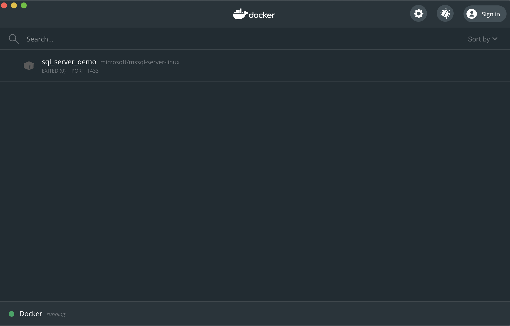
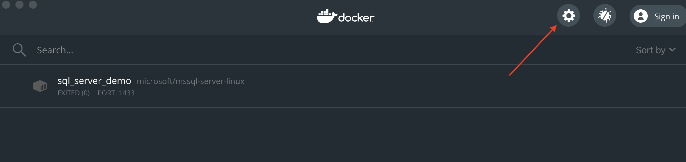
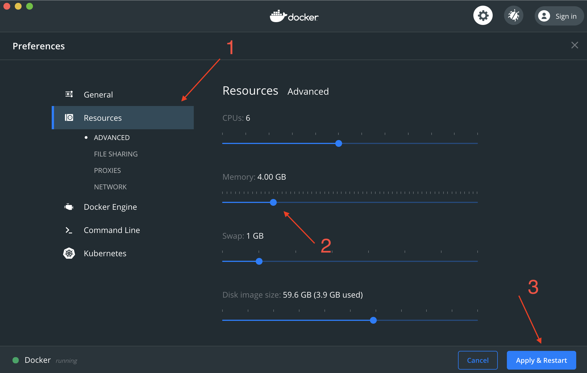
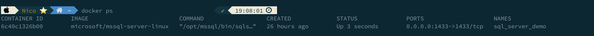
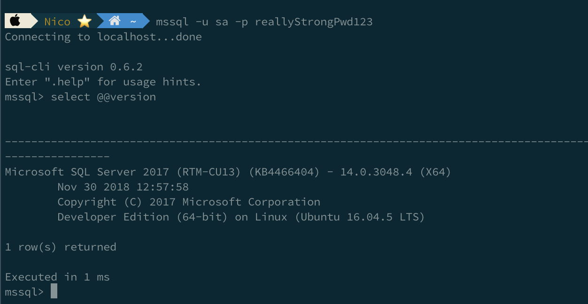
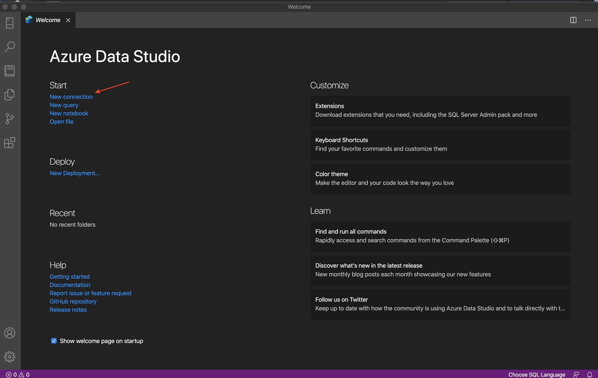
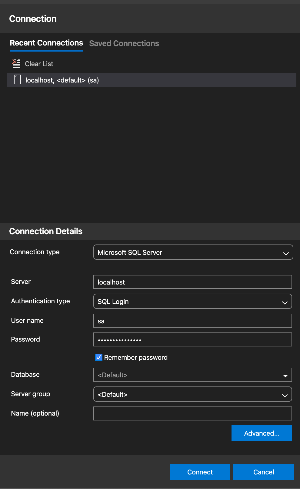
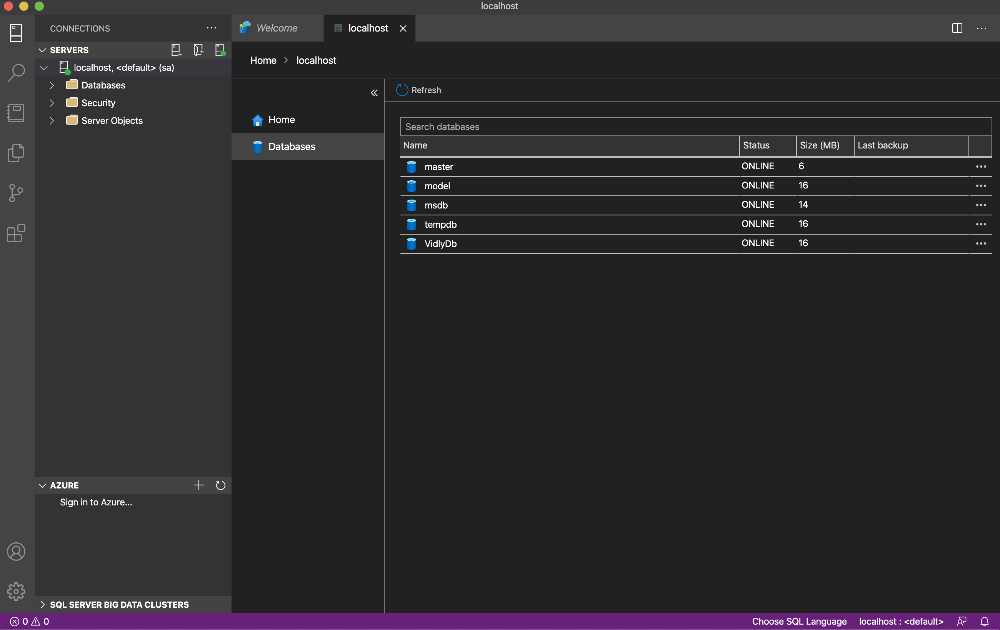
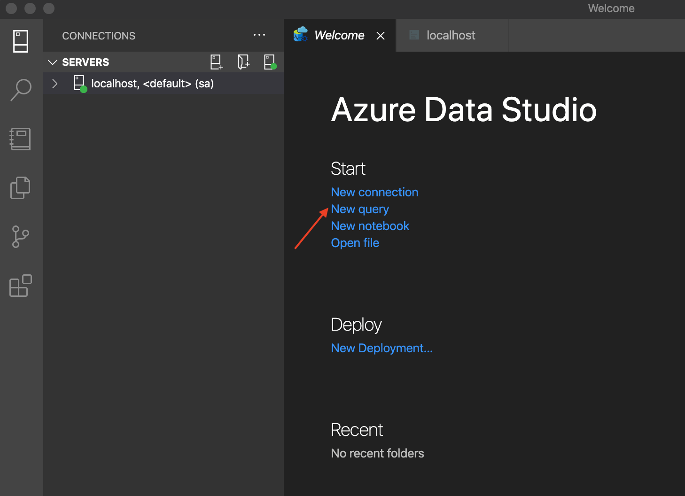
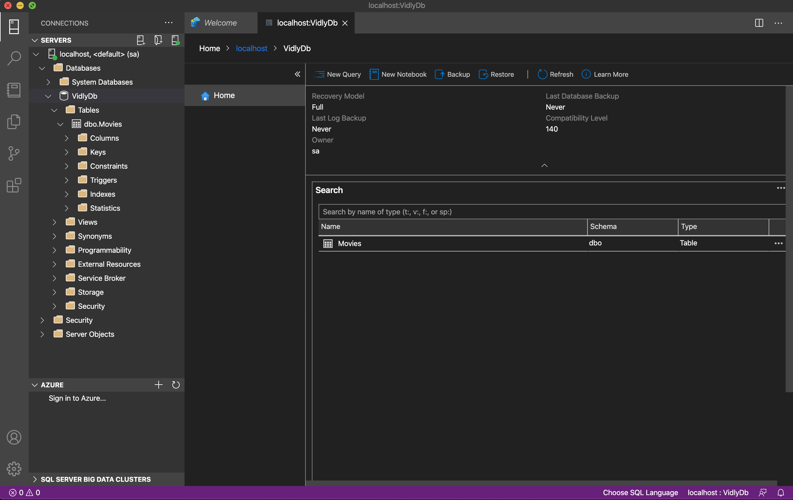

# Instalación SQL server MacOS

En esta guía vamos a ver cómo instalar y dejar corriendo nuestro ambiente con SQL server en MacOS. Para ello nos vamos a basar en usar Docker el cual va a correr un "container" con nuestro SQL Server, todo sin la necesidad de instalar maquinas virtuales ni otras cosas.

# 1 - Instalar docker

Lo primero que tenemos que hacer es instalar docker, el va a ser el encargado de correr por nosotros el sql server en lo que se llama container.
Es Docker Community Edition es gratis para MacOS, les dejo el link [aca](https://hub.docker.com/editions/community/docker-ce-desktop-mac?tab=description)

Si quieren saber mas sobre docker y que son los containers [aca](https://docs.docker.com/get-started/) pueden leer.

# 2 - Setup docker

Ahora que instalamos docker vamos a correrlo, le damos los permisos necesarios para que corra y eso nos va a llevar a una pantalla como esta.



También vamos a ver el siguiente icono en nuestra barra de aplicaciones en la esquina superior derecha


Docker por defecto viene con 2GB de Ram disponibles para su uso, se recomienda aumentar ese limite hasta 4GB. Para esto vamos a `preferences` y hacemos lo siguiente



Vamos a resources y hacemos el cambio, aplicamos y reiniciamos nuestra maquina.



# 3 - Descargar SQLServer

Ahora que tenemos docker instalado y hicimos todas las configuraciones necesarias podemos descargar e instalar nuestro contenedor con SQLServer.

Abrimos nuestra terminal y corremos el siguiente comando.

```bash
docker pull microsoft/mssql-server-linux
```

# 4 - Iniciar SQLServer

Para iniciar nuestro SQLServer vamos a nuestra terminal nuevamente y corremos el siguiente comando

```bash
docker run -d --name sql_server_demo -e 'ACCEPT_EULA=Y' -e 'SA_PASSWORD=reallyStrongPwd123' -p 1433:1433 microsoft/mssql-server-linux
```

Si quieren pueden reemplazar el nombre y contraseña por el que queramos. También tengan en cuenta que si descargaron una imagen diferente de sql en el comando anterior deberían reemplazar `microsoft/mssql-server-linux`

## Explicación de los parámetros.

Here’s an explanation of the parameters:

- `**d**`

Parametro opcional que corre nuestro contenedor de Docker en modo daemon. No nos interesa en este momento.

- **`-name sql_server_demo`**

Otro parametro opcional. Sirve para determinar el nombre del contenedor.

- **`e 'ACCEPT_EULA=Y'`**

La Y muestra que aceptamos el EULA (End User License Agreement), esto es **necesario** para poder tener nuestro SQLServer corriendo en MacOS

- **`e 'SA_PASSWORD=reallyStrongPwd123'`**

La contraseña del user **sa** para nuestra base de datos.

- **`p 1433:1433`**

Mapea el puerto local 1433 al puerto 1433 de nuestro contenedor de Docker, este es el puerto por defecto que usa SQLServer para escuchar por conexiones entrantes.

**`microsoft/mssql-server-linux`**

La imagen de docker a usar.

## **Errores**

En caso de ver el siguiente error

```bash
Microsoft(R) SQL Server(R) setup failed with error code 1. Please check the setup log in /var/opt/mssql/log for more information.
```

Es porque nuestra contraseña no es lo suficientemente segura. Deberíamos correr el comando anterior con una contraseña más segura.

# 5 - Chequear Container

Vamos a chequear de que todo allá salido bien y tengamos nuestro container corriendo.

Para esto corremos el siguiente comando

```bash
docker ps
```

Si todo marcho bien deberían ver lo siguiente.



# 6 - Chequear conexión a SQLServer

Para esto vamos a necesitar las `sql-cli command line tools`

```bash
sudo npm install -g sql-cli
```

Para correr este comando necesitan NodeJS, si lo lo tienen descargado pueden descargarlo desde [acá](https://nodejs.org/) y después correr este comando

Nos conectamos a SQLServer usando el siguiente comando con nuestro nombre de usuario y contraseña como parámetros.

```bash
mssql -u sa -p reallyStrongPwd123

select @@version
```

Si todo funciono bien deberían ver lo siguiente



Con esto tenemos nuestra base de datos corriendo en sql y podemos conectarla con nuestra WebAPI, pero antes de eso vamos a descargar una herramienta que nos va a facilitar el uso y nos permite crear bases de datos, ver tablas y correr queries sobre dichas tablas.

# 7 - Azure Data Studio

Azure Data Studio (formerly SQL Operations Studio) es un herramienta GUI que se puede hacer para controlar SQLServer en nuestro MacOS. Se pueden crear bases de datos, etc.

Para descargar **[Azure data studio](https://database.guide/what-is-azure-data-studio/)** 👈🏼

### Conectándose a SQLServer con Azure Data Studio



Para esto usamos la contraseña que usamos para crear nuestro container.



Cuando nos conectamos podemos ver la siguiente pantalla



### Crear una base de datos en Azure Data Studio (Opcional, CodeFirst lo hace solo)

Vamos a crear una base de datos por medio del Azure Data Studio, para esto corremos una nueva query y hacemos lo siguiente.



```sql
/* Create database */
CREATE DATABASE VidlyDB;
GO

/* Change to the VidlyDB database */
USE VidlyDB;
GO

/* Create tables */
CREATE TABLE Movies (
    Id int IDENTITY(1,1) NOT NULL PRIMARY KEY,
    Name nvarchar(255) NOT NULL,
    Description nvarchar(255) NOT NULL,
);
```

Esto nos crea la siguiente base de datos en la cual podemos realizar inserts y conectarnos para usar en nuestro obligatorio.



# 8 - Conectar nuestra WebAPI con nuestra bd de SQLServer.

**ConnectionString**

```sql
"Server=127.0.0.1,1433;Database=VidlyDb;Trusted_Connection=false;MultipleActiveResultSets=true;User=sa;Password=reallyStrongPwd123;"
```

Importante tener el Trusted_Connection=false ya que sino no nos va a funcionar, esto hace que tengamos que poner nuestras credenciales explícitamente en el connectionString.
