# Guía 1

## **Algunos conceptos básicos:**

## 1 - Web tradicionales

Las web tradicionales hacían una request al servidor para obtener el `index.html` y luego ante cada acción, volvían a traer el html entero con los nuevos datos a mostrar y el navegador simplemente renderizaba ese html.

Por ejemplo:

https://www.tic.com/index.html

Si hacen pruebas con la web mencionada, van a ver que ante cada click, carga el html entero.

## 2 - Single Page Applications (SPA)

Las SPA hacen la request inicial al servidor para obtener el `index.html` y luego ante cada acción, hacen una request al servidor en la que mandan y reciben datos, que luego se muestran en la UI. No se renderiza nuevamente todo el html, si no que se renderiza solo la porción de html que se necesita cambiar de acuerdo a la acción realizada. Agrego, quito o modifico componentes del html principal.

Lean todo el material teórico porque después se puede preguntar en las pruebas de clase o en el parcial. Esta guía va a mencionar algunos conceptos, necesarios para poder dar la clase. Repasen el teórico, características de SPA, Qué es angular, por qué angular? Angular 2 vs 1, Por qué se necesita usar transpilers, características de TypeScript, etc.

## 3- Arquitectura de una aplicación Angular

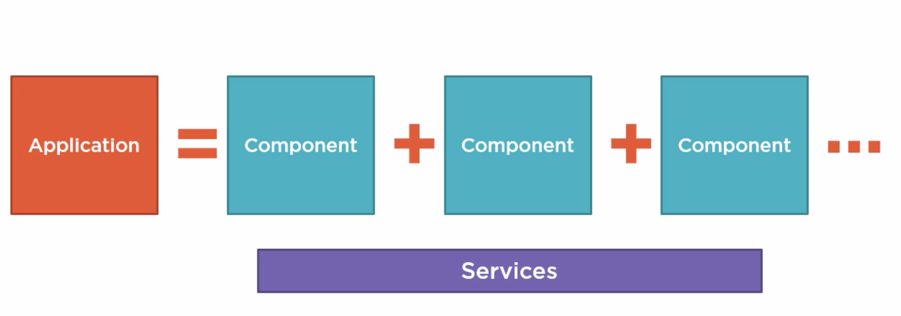

En **Angular**, una aplicación **se define a partir de un conjunto de componentes**, del mismo modo que también de servicios subyacentes que son comunes a ellos  y permiten el reuso de la lógica. Por ejemplo: servicios para contectarse con APIs REST, servicios que manejen la sesión desde el lado del cliente, servicios de autenticación, etc.

## 4 - ¿Qué es un componente en Angular?

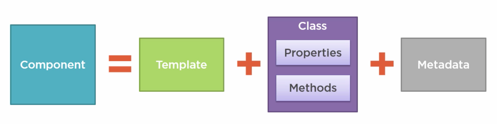

Un componente es una una unidad modularizada que define la vista y la lógica para controlar una porción de una pantalla en Angular. Cada componente se compone de:

- Un **template (que es el HTML para la UI, también llamado la View)**. Sin los datos, por eso un template. Los datos serán inyectados de forma dinámica.

- Una **clase que es el código asociado a la View**, teniendo properties/datos que están disponibles para el uso de la vista, y métodos que son lógica o acciones para dichas views. Por ejemplo: responder a un click de un botón, o a un evento.

- **Metadata**, la cual provee información adicional del componente a Angular. Es lo que identifica a la clase  asociada al componente.

## 5 - ¿Cómo hacemos que todos estos componentes se integren en una app en Angular? - Con Angular Modules

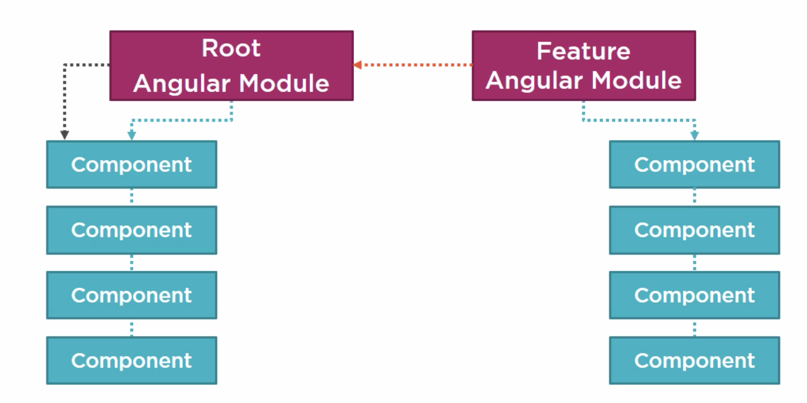

Esto se logra a partir de lo que se llaman, **Angular Modules**. Permiten organizar los componentes en funcionalidad cohesiva. Cada app Angular tiene por lo menos un Angular Module, llamado **Root Angular Module**.

Por convención, al Root Module se le llama **AppModule** en la Angular app.

Una app puede tener un número de modulos adicionales, incluyendo **`Feature Angular Modules`**, que se usan para lograr una funcionalidad en especial. Consolidan un conjunto de componentes para una feature particular de una aplicación.

Los módulos de Angular, sin importar si son root o feature, son clases anotadas con el **decorator `@NgModule`**

## 6 - Decorators

Son simplemente funciones que van a modificar las clases de JavaScript. Angular define un montón de decoradores que agregan metadata a las clases que vayan definiendo, de manera que puedan agregarle funcionalidad extra a esas clases.

# Tutorial: Armando nuestro ambiente

## 1 - Instalando Node


Para poder utilizar Angular, deben instalar **Node.js**, que es un entorno de ejecución para javascript y **NPM** o (*Node Package Manager*) es una **Command Line Utility** que permite interactuar, de una forma muy simple, con un repositorio enorme de proyectos *open-source*. Ha ganado muchísima popularidad al punto en que se ha convertido en el package-manager para JavaScript. Con él, pueden instalar librerías, paquetes, aplicaciones, en conjunto con las dependencias de cada uno.

Lo pueden instalar de la siguiente manera:

### Windows
https://nodejs.org. Les recomiendo instalar la version 16.16.0 para que tengan la misma que está instalada en el laboratorio.

### Mac
Instalan `brew`, si no lo tienen: https://brew.sh/
Luego de instalar brew, instalan `nvm`: https://formulae.brew.sh/formula/nvm
Una vez que tienen `nvm` instalado, ejecutan estos comandos de a uno:

`nvm install 16.16.0`

`nvm alias default 16.16.0`

`nvm use default`

Si tienen el siguente error: `nvm command not found`, deben hacer lo siguiente:

`sudo vi ~/.zshrc`

ingresan su password

les va a aparecer un editor y apretan i para insertar texto y agregan lo siguiente:

```
  export NVM_DIR="$HOME/.nvm"
  [ -s "$NVM_DIR/nvm.sh" ] && \. "$NVM_DIR/nvm.sh"
  [ -s "$NVM_DIR/bash_completion" ] && \. "$NVM_DIR/bash_completion"
```

### ¿Por qué lo usaremos en nuestras Apps de Angular? 

1) Lo vamos a usar para instalar todas las librerías de Angular, es decir las dependencias.

2) También para ejecutar los transpiladores de nuestro código. NPM nos permitirá correr el compilador que convierta todos nuestros **`.ts`** en **`.js`**, de una forma muy simple, para que el navegador los pueda reconocer correctamente.

3) Funciona también como **WebServer**, que "servirá" nuestras Angular SPAs, en un web server liviano. Esto es mucho más cercano a un escenario real y evita problemas que suelen existir cuando accedemos directamente a los archivos a partir de su path en disco (`file://miarchivo.html`)

## Iniciando con ANGULAR

1. **Configurar el entorno de desarrollo** - Instalar Angular CLI ```npm i -g @angular/cli@15.2.4``` (este comando instala el cli de angular de manera global y solo debemos ejecutarlo cuando no se encuentra el CLI instalado en nuestra computadora)
2. **Crear el proyecto** - ```ng new NombreDelProyecto``` (si no se coloca un nombre se crea en el proyecto actual)
El instalador les puede hacer algunas preguntas:
- Would you like to add Angular routing? 
respondan: `y` (yes).
- Which stylesheet format would you like to use? (Use arrow keys)
Con la flechita para abajo bajen hasta seleccionar `scss` y apreten ENTER.

3. **Ejecutamos nuestro proyecto** - ```ng serve --open``` (--open abre una ventana en el navegador en ```http://localhost:4200/```)

## 3 - ¿Qué sucede al levantar la app?

Para arrancar la app usamos el comando ```ng serve```. Esto lo que hace es levantar un Web Server para que el navegador pueda consumir los archivos desde ahí. Es simplemente un ambiente local, que funciona como un ambiente real.
A su vez, se ejecuta **tsc, el TypeScript Compiler**, el cual compila los archivos `.ts` y los transpila a `.js`. En el VisualStudioCode, van a ver que por cada `.ts` que tengan, van a tener un `.js` y un `.js.map`, que fueron generados por el typescript compiler, que transpiló todos los archivos `.ts` a `.js`, para que el browser pueda entenderlos.
También van a ver que el TypeScript compiler y el FileServer que levantaron, “watchea” cualquier cambio a nivel de código, de manera que cada vez que hagan un cambio en el código, TypeScript lo va a recompilar y automáticamente van a ver los cambios en el navegador.

Ejemplo:

* 1  Cambio el Componente de APP
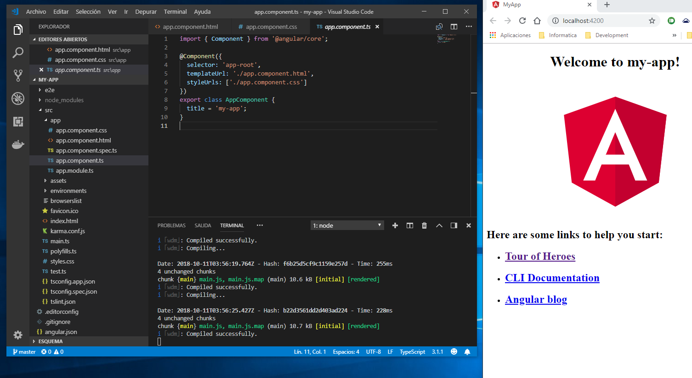
* 2  Guardo y veo como el watcher se activa
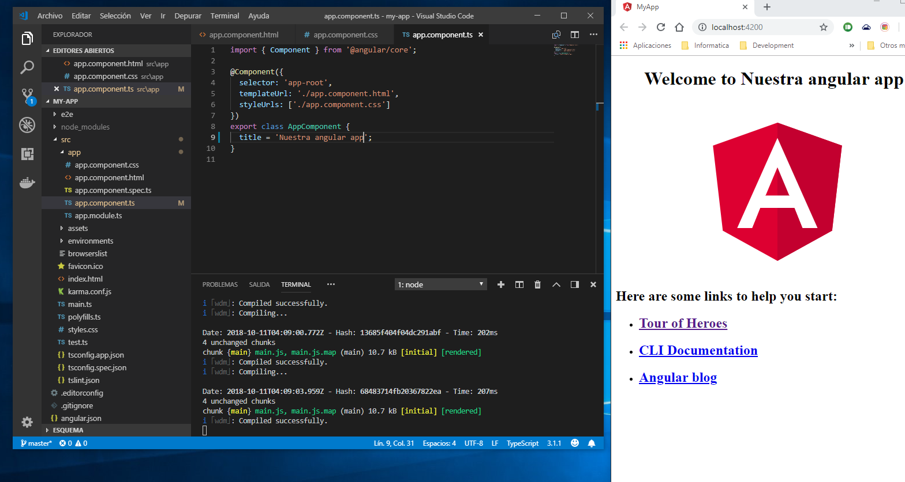
* 3 Instantáneamente los cambios en la vista se reflejan en el navegador

## 4 - El punto de entrada de nuestra aplicación

El flujo es el siguiente: el usuario hace una request al servidor

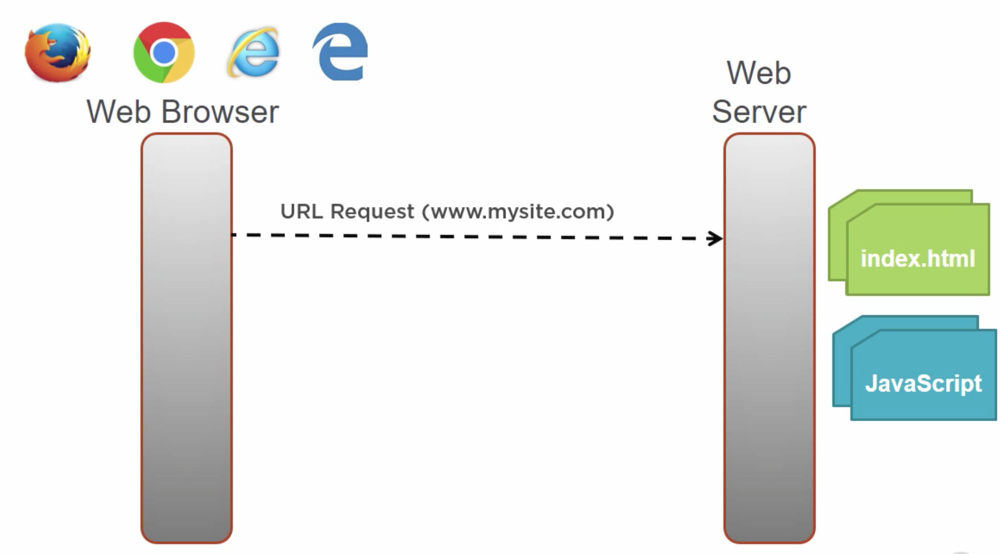

Y este le contesta:

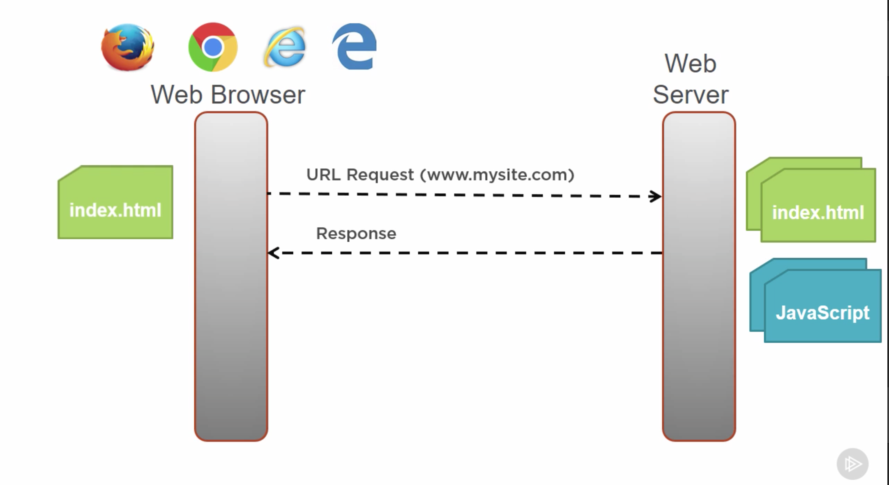

Si van a ver el index.html ahora, van a ver que aparece un `app-root` en el body que hace referencia al componente principal el `app.component`. Y no tiene archivos `js` ni `css` porque estos van a ser agregados por el cliente de angular, cuando hagamos el build de nuestra app. Entre los `js` que vamos a tener ahí está el `main.js`, que es nuestro `main.ts` después de la transpilación.

Al momento de hacer el `build`, `Angular` va a chequear el archivo `angular.json`. En ese archivo en la parte de `architect` -> `build` -> `options` -> `main` encontramos la ruta al archivo `main.ts`: `src/main.ts`.

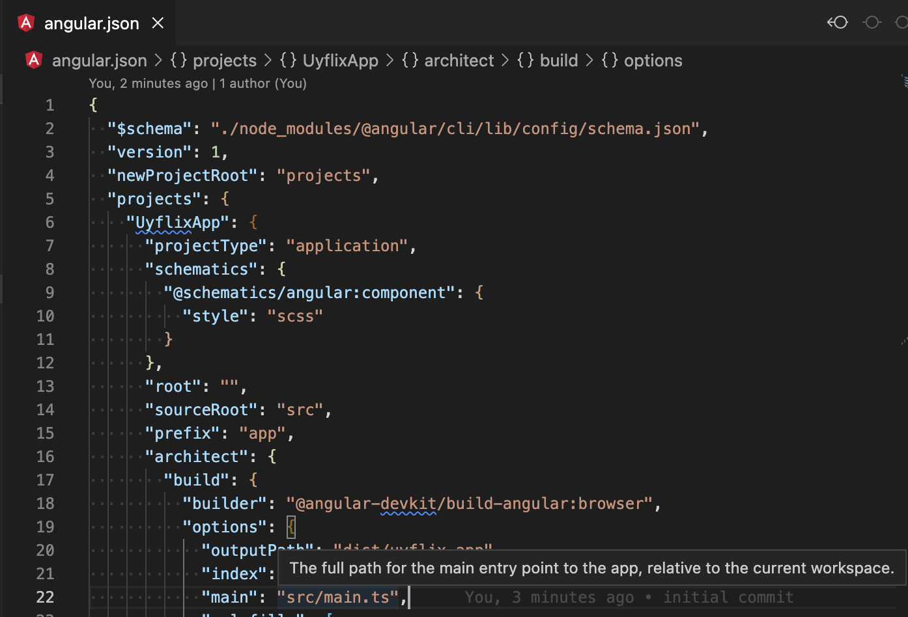

Si van al archivo `main.ts` van a ver que se setea el `bootstrapModule`, es decir, el módulo de arranque al `AppModule` que es el `Root Angular Module`. 

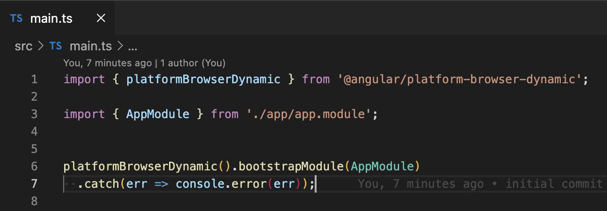

Vayan al `AppModule`. Acá voy a ir mechando la parte de introducción a módulos así van teniendo una idea de qué es un módulo.

### **Introducción a Módulos**

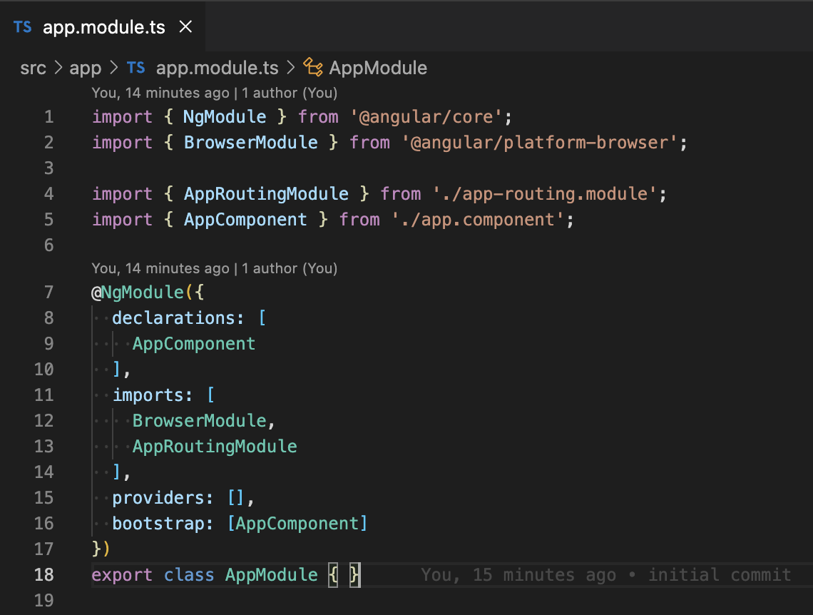

Los módulos son clases anotadas con el decorator `@NgModule` que se le pasa una configuración en formato `json` que contiene:
`Declarations`: que es donde van a tener que poner todos los componentes que va a incluir este modulo.
`Exports`: donde vamos a poner los componentes que queremos que sean visibles para otros módulos (el `AppModule` es el modulo raíz por lo que no tiene `exports` pero si hacemos un `feature angular module`, sí vamos a tener que exportar los componentes que queramos hacer visibles a otros módulos).
`Imports`: donde van los módulos que necesitemos.
`Providers`: donde vamos a poner los servicios que aporta este módulo a la colección de servicios globales y, vamos a ver también que acá van a ir, los interceptors. Después vamos a ver bien qué son.
`Bootstrap`: es donde vamos a definir cuál es el componente raíz de la aplicación. Esto solo se define en el `root module` que es este `AppModule`.

Para terminar con la introducción a módulos, para crear un módulo tienen que hacer: `ng generate module NombreDelModulo`


Cómo se ve en la imagen, en `bootstrap` setea como componente de arranque, al `AppComponent`. Vayan al AppComponent`. Voy a mechar la introducción a los componentes.

### **Introducción a Componentes**

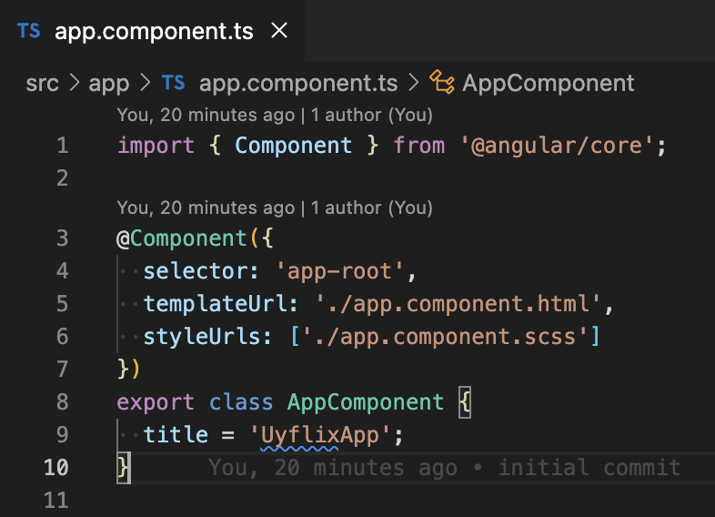

Como ven en la imagen, tiene el decorator `@Component`, que es una función que recibe una configuración en formato JSON, que especifica:

- El selector, que es el tag html con el que van a llamar al componente

- El template url, que especifica la url al archivo que tiene la vista

- Y style urls, que son las urls a los archivos css asociados al componente.

El componente controla una parte de la pantalla. En el proyecto de esta guía ya tienen que tener el componente App, que va a ser el componente de arranque. En este componente, van a ver que hay una etiqueta llamada `router-outlet` que es la que va a ser capaz de renderizar la página a la cual hayan navegado y va a cargar el componente asociado a esa ruta, tal cuál lo hayan definido en el `routing module`. En esta guía vamos a estar manejando una única pantalla, pero más adelante sí vamos a estar utilizando la navegación.

Para crear un componente van a tener que ejecutar:
`ng generate component NombreDelComponente`

Primero, paren la ejecución de la app haciendo `CTRL + C` en la terminal donde ejecutaron el `ng serve`.

Siempre que ejecuten estos comandos les va a crear lo que le pidan en el directorio en el que están parados. Así que si quieren crear un component dentro de la carpeta components por ejemplo, tienen que hacer 

`ng generate component components/NombreDelComponente`

Si ejecutan el siguiente comando:
`ng generate component components/MovieList`

Les va a crear una carpeta components y adentro de ella, un componente llamado MovieList.

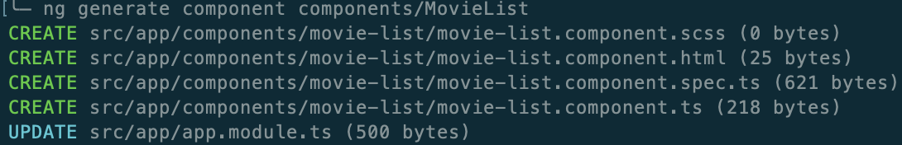

Cómo ven, crea un archivo de estilos scss para ese componente,
- El template, la vista o html, como quieran decirle, para ese componente,
- Un archivo de test para los tests de ese componente,
- La clase para poner el código asociado a la vista.
- Y hace un update en el AppModule

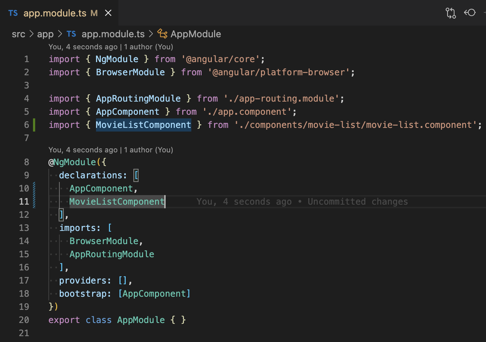

Hizo el import del componente y lo agregó a las declaraciones del módulo porque, por defecto, va a ser un componente de este módulo.

El código del componente recién creado es el siguiente:

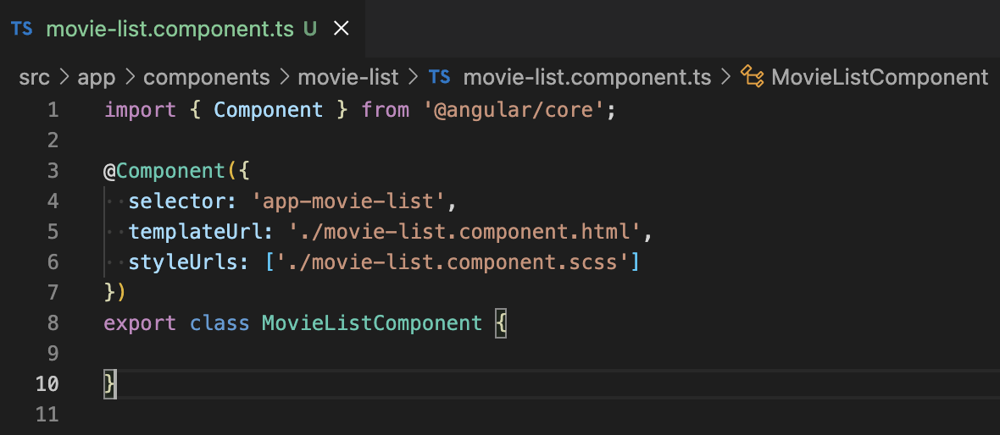

Como ven, tiene el decorator `@Component` con una configuración en formato JSON que especifica:

- El selector, que es el tag html con el que van a llamar al componente.
- El template url, que especifica la url al archivo que tiene la vista
- Y style urls, que son las urls a los archivos css asociados al componente.

### **Lifecycle hooks**

Por defecto, según la versión del CLI de angular, puede implementar la interfaz OnInit que tiene el hook `ngOnInit` que se dispara cuando inicia el componente.
https://angular.io/guide/lifecycle-hooks

Otros hooks que les puede interesar:

- `ngOnChanges`: se dispara ante cada set o reset de cada `input property` del componente. Más adelante van a entender qué es un input o output property. Tienen que tener cuidado con la lógica que utilicen acá porque puede afectar la performance. Este hook al inicio se llama antes del `ngOnInit`. El método recibe un objeto de tipo `SimpleChanges` con una property que tienen el valor anterior y otra property que tiene el valor actual (previous y current).
- `ngAfterViewInit` se llama por única vez luego de que se cargó la vista del componente. Este hook se dispara luego del `ngOnInit`.
- `ngOnDestroy`: este hook se dispara inmediatamente antes de que se destruya el componente.

### **Volviendo al componente**

Volviendo al componente, vayan al html (`movie-list.component.html`) para ver que tiene la vista. Por defecto crea la vista con un párrafo con el nombre del componente espacio works y un símbolo de exclamación.

Para usar este componente, por el momento hay 2 opciones. Lo llaman en el `app.component.html` o agregan una ruta a ese componente.

Prueben la más sencilla primero, pongan <app-movie-list></app-movie-list> en el `app.component.html` para llamar al componente.

Inicien la app nuevamente con el comando: `ng serve --open`

Van a ver, al final de la página, el texto movie-list works!

La otra opción es agregar una ruta al componente. Para esto vamos a editar el archivo `app-routing.module.ts`

### **Routing module**

Este módulo importa el router module para las rutas definidas y exporta el router module para que pueda ser utilizado (importado) por otro módulo (en este caso por el `AppModule`).
En el array routes, tienen que definir las rutas a sus páginas.

En este caso, con fines de testing, van a agregar el siguiente objeto:

```json
{ path: '', component: MovieListComponent }
```

- El path: '' significa que el componente se va a cargar en la raíz de la aplicación.
- El component, cómo pueden ver, especifica el componente a cargar en la url especificada.

**Guardar y ver que todo sigue igual.**

Si colocan `path: '/movies'` va a cargar ese componente si van a `localhost:4200/movies`

Borren el placeholder del `app.component.html` para que solo se vea el componente `MovieList`. Es decir, solo debería quedar en ese archivo lo siguiente:
```html
<div class="header">
  <h1>Uyflix</h1>
</div>
<div class="container">
  <router-outlet></router-outlet>
</div>

```

Agreguen los siguientes estilos al `app.component.scss`:

```css
.header {
    display: flex;
    font-size: 18px;
    background-color: #C5EFCB;
    justify-content: center;
    border-color: #758173;
    border-style: none none solid none;
    flex-direction: column;
    align-items: center;
}
  
.container {
    width: 100%;
    justify-content: center;
    position: relative;
}

```

y al `src/styles.scss`, le van a agregar lo siguiente:

```css
body {
    margin: 0;
    padding: 0;
    display: flex;
}

```

Para mejorar el manejo de las rutas, van a crear un archivo utilitario. En `src/app`, crean la carpeta `utils` y adentro de esa carpeta el archivo `routes.ts`. Adentro de ese archivo van a poner el siguiente código:

```javascript
export enum PATHS {
    MOVIES = 'movies',
}

export enum SEGMENTS {
    NEW = 'new',
}

export const idParam = ':id'

export const MOVIE_LIST_URL = PATHS.MOVIES;

export const MOVIE_FORM_URL = `${PATHS.MOVIES}/${idParam}`;

export const getUrl = (url: string, paramKey: string, paramValue: string | number): string =>
    url.replace(paramKey, paramValue?.toString());

export const ADD_MOVIE_URL = getUrl(MOVIE_FORM_URL, idParam, SEGMENTS.NEW);

```

Cómo ven para las rutas, van a manejar Paths, segments y params (por ejemplo el `idParam`). La ruta a la página de movies va a ser `/movies`, cómo ya vimos, y más adelante vamos a agregar rutas al `MovieForm`, que es un componente que todavía no sabemos qué va a tener.

La función `getUrl`, es una función genérica que toma la url, el paramKey y el paramValue y retorna la url habiendo remplazado el paramKey por el paramValue.

De esta forma, pueden usar esa función para armar cualquier url, pero con solo un parámetro. Si necesitan más parámetros, van a tener que recibir una lista con cada paramKey y paramValue, hacer el forEach y hacer el replace de cada param.

Después de haber creado este utilitario, el `app-routing.module.ts` debería verse así:

```javascript
import { NgModule } from '@angular/core';
import { RouterModule, Routes } from '@angular/router';
import { MovieListComponent } from './components/movie-list/movie-list.component';
import { MOVIE_LIST_URL } from './utils/routes';

const routes: Routes = [
  { path: '', component: MovieListComponent },
  { path: MOVIE_LIST_URL, component: MovieListComponent },
];

@NgModule({
  imports: [RouterModule.forRoot(routes)],
  exports: [RouterModule]
})
export class AppRoutingModule { }

```

Agregué el path `movies` al agregar `MOVIE_LIST_URL`.

Ahora van a agregar el modelo Movie. Para eso se crean una carpeta models adentro de la carpeta `src/app` y crean el archivo `movie.ts` que va a tener lo siguiente:

```javascript
export class Movie {
    id: number;
    name: string;
    category: string;
    director: string;
    country: string;
    year: number;
    rating: number;

    constructor(id: number, name: string, category: string, director: string, country: string,
        year: number, rating: number) {
        this.id = id;
        this.name = name;
        this.category = category;
        this.director = director;
        this.country = country;
        this.year = year;
        this.rating = rating;
    }
}
```

La clase con su constructor con parámetros.

Al principio no van a tener conexión con la API, así que van a necesitar hardcodear movies en algún lado. Una opción es crear un `servicio` que maneje las películas en `memoria`, pero como todavía no vieron servicios (lo van a ver en la siguiente guía), van a crear movies en un método privado para inicializar el array de movies del componente con algunas películas.

El código del componente debería verse de esta forma:

```javascript
import { Component, OnInit } from '@angular/core';
import { Movie } from '../../models/movie';

@Component({
  selector: 'app-movie-list',
  templateUrl: './movie-list.component.html',
  styleUrls: ['./movie-list.component.scss']
})
export class MovieListComponent implements OnInit {
  public filterValue: string = '';
  public movies: Movie[] = [];

  constructor() {}

  public ngOnInit(): void {
    this.movies = this.initializeMovies();
  }

  private initializeMovies(): Movie[] {
    return [
      new Movie(1, "La Era de Hielo", "Animada", "Chris Wedge y Carlos Saldanha", "Estados Unidos", 2002, 5),
      new Movie(2, "El Aro", "Terror", "Gore Verbinski", "Estados Unidos", 2002, 4),
      new Movie(3, "Rápido y Furioso", "Acción", "Rob Cohen", "Estados Unidos", 2001, 3),
      new Movie(4, "Joker", "Suspenso", "Todd Phillips", "Estados Unidos", 2019, 4),
      new Movie(5, "Bajocero", "Suspenso", "Lluís Quílez", "España", 2021, 2),
    ];
  }
}

```

Lo que se agregó fue una property pública movies para manejar las `movies`, una property `filterValue` y el hook `ngOnInit` para cargar las `movies` cuando se inicie el componente, utilizando un método privado.

Van a agregar estilos al archivo `movie-list.component.scss`:

```css
.movie-list-container {
    display: flex;
    flex-direction: column;
    margin-left: 1rem;
    margin-right: 1rem;
}

.movie-list-header {
    display: flex;
    justify-content: space-between;
}

.movie-list-filter-input {
    width: 20rem;
    font-size: 1.5rem;
    padding: 0.5rem;
    border-radius: 1rem;
}

.movie-list-button {
    border: solid;
    width: fit-content;
    padding: 0.313rem;
    border-radius: 1.25rem;
    background-color: #A9C5A0;
    border-color: #A9C5A0;
    color: white;
    font-size: 1.625rem;
    cursor: pointer;
}

.movie-list-button:hover{
    background-color: #C5EFCB;
    color: black;
}

.movie-list {
    display: flex;
    flex-flow: wrap;
    font-size: 1.5rem;
    margin-top: 2rem;
    gap: 1rem;
}

.movie-list-no-movies-message {
    padding: 10px;
    border: 2px solid black;
    display: flex;
    align-items: center;
    justify-content: center;
}
```

Van a agregar el siguiente código en la vista (`src/app/components/movie-list/movie-list.component.html`):

```html
<div class="movie-list-container">
    <h2 class="title">Películas</h2>
    <div class="movie-list-header">
      <input class="movie-list-filter-input" [(ngModel)]="filterValue" placeholder="Filtrar por" />
    </div>
    <p class="filter" *ngIf="filterValue">
      Películas filtradas por <b>{{ filterValue }}</b>
    </p>
    <div class="movie-list" *ngIf="movies && movies.length > 0; else elseBlock">
      <app-movie-item
        *ngFor="let movie of movies"
        [movie]="movie"
      >
      </app-movie-item>
    </div>
    <ng-template #elseBlock>
      <p class="movie-list-no-movies-message">No hay películas</p>
    </ng-template>
</div>
```

En la vista hay un título con un `h2` que dice `Películas` y un `header` que va a tener un `input` para poder hacer un `filtro`, que lo vamos a hacer más adelante. Lo agregué para mostrarles lo que es el `data binding` y `two-way data binding`.

El `data binding` es el enlace entre un pedazo de la vista y ciertos datos de la clase de un componente. Le decimos a la `UI` que mire el valor de la property que está en la clase del componente. Esto se llama interpolación, ponemos datos dentro de un HTML. Es lo que logramos con las llaves dobles {{ }}.

En el caso del `MovieListComponent` lo pueden ver cuando se hace 
```
Películas filtradas por <b>{{ filterValue }}</b>
```

Como ven hay un `*ngIf` que es una `directiva` de angular que lo que nos permite es mostrar una porción de html si se cumple cierta condición. En este caso que `filterValue` no esté vacío. Es decir, que si no está definida o es nula o es vacía, no se va a cargar ese párrafo en el html. La diferencia con el `display: none` es que el `display: none` va a cargar ese pedazo de html mientras que el `*ngIf` si no se cumple la condición directamente **no se carga**.

Cuando veamos `componentes anidados`, van a entender la ventaja de esto.

Siguiendo en el código, está la lista que tiene un `*ngIf` que valida que movies esté definida y tenga elementos. Es decir, que el largo sea mayor que cero. En ese caso va a mostrar el `div` y en el `else` va a ir al elemento con la etiqueta `elseBlock`. Si tengo elementos que los muestre y si no tengo, que muestre el `elseBlock` que se define con un `ng-template` y el nombre de la etiqueta que le queramos poner en este caso `elseBlock`. Adentro tiene un parrafo con un mensaje de que no hay películas.

En el caso de que haya elementos, van a llamar a un componente que es el que sabe como mostrar la película. Para esto van a iterar sobre el array de películas utilizando la directiva `*ngFor`. Van a tener un `app-movie-item` por cada movie. Let `movie` of `movies`, carga en `movie`, la película y se la van a pasar al componente `MovieItem`. Acá aparece otra forma de hacer `data binding` que se llama `Property binding`. En este caso, el componente padre que es el `MovieList` al componente hijo que es el `MovieItem`. `[movie]='movie'`. El componente `MovieItem` tiene una property `movie` que es un `Input (input property)`, al cual le asignan una expresión, en este caso, la `movie`, que quieren mostrar. Acá ven el concepto de `componentes anidados`. El `MovieList` es un componente que adentro tiene otro componente que es el `MovieItem`. El `MovieItem` requiere que le pasen una `movie` para poder funcionar, por lo tanto si no hay películas no va a aparecer ningún `MovieItem` y quedaría un `div` vacío en el `html`, por eso la importancia del `*ngIf` `movies` que tiene el `div`, ayudado por el `else` que le da **feedback** al usuario de por qué no se muestra la lista esperada.

Ahora van a crear el componente `MovieItem`

Para eso tienen que parar la app. Parados en la terminal en la raíz del proyecto, ejecutan el siguiente comando: `ng generate component components/MovieItem`, crea los 4 archivos y declara el componente en el `AppModule`. Ahora pueden ver que el error sobre el `app-movie-item` ya no está pero dice que `movie` no es una propiedad conocida de `MovieItem`. Así que la tienen que agregar.

Van al componente (`src/app/components/movie-item/movie-item.component.ts`) y agregan la `input property`. El componente por ahora les debería quedar así:

```javascript
import { Component, Input } from '@angular/core';
import { Movie } from '../../models/movie';

@Component({
  selector: 'app-movie-item',
  templateUrl: './movie-item.component.html',
  styleUrls: ['./movie-item.component.scss']
})
export class MovieItemComponent {
  @Input() public movie: Movie | undefined;
}

```

El css del archivo `movie-item.component.scss`:

```css
.movie-item-card {
    display: flex;
    flex-direction: column;
    margin: 0.25rem;
    border: 0.25rem solid black;
    border-radius: 2.188rem;
    padding: 1.25rem;
    min-width: 10rem;
}
  
.movie-item-card:hover {
    background-color: #C6DEC6;
    border-color: #A9C5A0;
    cursor: pointer;
}

.movie-item-delete-button-container {
    display: flex;
    justify-content: center;
}

.movie-item-delete-button {
    margin-top: 0.5rem;
    background: none;
    border-radius: 2.188rem;
    border: 0.15rem solid red;
    color: red;
    width: 6.25rem;
}

.movie-item-delete-button:hover {
    background: red;
    color: white;
    cursor: pointer;
}

```

El html del componente hijo (`src/app/components/movie-item/movie-item.component.html`).

```html
<div class="movie-item-card">
  <div>
    <div>{{ movie?.name }}</div>
    <div>{{ movie?.category }}</div>
    <div>{{ movie?.director }}</div>
    <div>{{ movie?.country }}</div>
    <div>{{ movie?.year }}</div>
    <div>{{ movie?.rating }}</div>
  </div>
  <div class="movie-item-delete-button-container">
    <button
      class="movie-item-delete-button"
      (click)="onDelete()"
    >
      Borrar
    </button>
  </div>
</div>
```

En el `html`, se hace uso de la interpolación, pero en vez de mostrar todo el objeto movie, se muestra uno a uno los atributos de la clase `Movie`, con el símbolo de pregunta, que es un `safe operator`, porque la `input property` `movie` puede ser de tipo `Movie o undefined`, que es como se inicializa.

Abajo ven el botón de `delete`, para borrar la película, con la función `click`, que es un `event binding`. A cierto evento, en este caso, el `click`, se le asigna un statement, en este caso, una función que se llama `onDelete`. Entonces, hay que crear esa función `onDelete` que no recibe nada. Ya vieron como pasarle la información de padre a hijo, a través del decorator `@Input()` y queda ver cómo le hace saber el componente hijo al padre, que hicieron `click` en el botón de borrar.

**Qué pasa?** Ustedes podrían mandar borrar la película desde el componente hijo, pero el que está iterando las películas es el padre. Entonces si mandan borrar una película y el padre no se entera, el array de `movies` va a seguir siendo el mismo, por lo tanto en la `UI` no van a notar el cambio.

**Se entiende?** Para que el hijo le avise al padre, van a utilizar el decorator `@Output()` con un `EventEmitter` de tipo `Movie`. Entonces van a emitir el evento `delete` con la información de la película que el usuario quiere borrar.

El código del `MovieItemComponent` les debería quedar de la siguiente forma:

```javascript
import { Component, EventEmitter, Input, Output } from '@angular/core';
import { Movie } from '../../models/movie';

@Component({
  selector: 'app-movie-item',
  templateUrl: './movie-item.component.html',
  styleUrls: ['./movie-item.component.scss']
})
export class MovieItemComponent {
  @Input() public movie: Movie | undefined;
  @Output() public delete: EventEmitter<Movie> = new EventEmitter<Movie>();

  public onDelete(): void {
    this.delete.emit(this.movie);
  }
}

```


En el `html` del componente padre van a hacer el `event binding` de ese `delete event` y le van a asignar un statement, en este caso la función `deleteMovie`, y le van a pasar `$event`, que es la información del evento en este caso `la película`. La porción de código del `app-movie-item` dentro del componente `movie-list.component.html` debería quedar de la siguiente manera:

```html
<app-movie-item
  *ngFor="let movie of movies"
  [movie]="movie"
  (delete)="deleteMovie($event)"
>
</app-movie-item>
```

La función `deleteMovie` del componente `movie-list.component.ts` debería quedar de la siguiente manera:

```javascript
  public deleteMovie(movieToDelete: Movie): void {
    const movie = this.movies?.find(movie => movie.id === movieToDelete?.id);
    if(!!movie) {
      this.movies = this.movies?.filter(movie => movie.id !== movieToDelete?.id);
    }
  }
```

La función hace un `find` en el array de **movies** para ver si existe la película, si existe la filtra, aplicando un `filter`. El `find` en este caso no es necesario, simplemente se agregó para que se vayan familiarizando con algunos métodos de manejo de arrays.

Volviendo a la vista del `MovieListComponent`, pueden ver que sigue marcando errores. Lo que está marcado en rojo es `[(ngModel)]='filterValue'`.
Hasta ahora vieron `interpolación`, `property binding` y `event binding`. Ahora van a ver `two-way data binding`. Es un ida y vuelta entre la **vista** y una **propiedad** del componente. Se muestra el valor de la **property** en la vista, si es seteada desde la clase del componente, y si en la **vista** cambia el valor, éste se setea a la **property**. Ahora lo van a ver cuándo se corrija el error que está marcando.

Les falta importar un módulo en el `AppModule`, más específicamente el `FormsModule` de `@angular/forms`. El código del `AppModule` les debería quedar de la siguiente manera:

```typescript
import { NgModule } from '@angular/core';
import { BrowserModule } from '@angular/platform-browser';
import { FormsModule } from '@angular/forms';
import { AppRoutingModule } from './app-routing.module';
import { AppComponent } from './app.component';
import { MovieListComponent } from './components/movie-list/movie-list.component';
import { MoviesService } from './services/movies.service';
import { MovieItemComponent } from './components/movie-item/movie-item.component';


@NgModule({
  declarations: [
    AppComponent,
    MovieListComponent,
    MovieItemComponent
  ],
  imports: [
    BrowserModule,
    AppRoutingModule,
    FormsModule,
  ],
  providers: [MoviesService],
  bootstrap: [AppComponent]
})
export class AppModule { }

```

Ahora pueden ejecutar la app con el comando `ng serve --open`

Y pueden ver la `UI`. En la raíz de la aplicación se ve la lista de películas. Tal como se definió en el `AppRoutingModule`. Si ponen `/movies` también va a cargar la lista de movies, pero si ponen `/pepe` se va a romper.

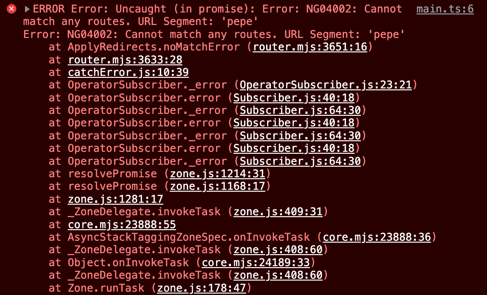

```
Por qué se rompe? Porque la app tiene solo tiene 2 rutas definidas y se quiso acceder a una que no está definida.
```

Hay que definir qué hacer en este caso. Una opción es decirle que cuando el path sea '**', es decir, cualquier otro que no esté definido anteriormente, redirigir a '', es decir, a la raíz de la app. 
`({ path: '**', redirectTo: '' })`

El código completo del `app-routing.module.ts` debería quedar de la siguiente manera:

```typescript
import { NgModule } from '@angular/core';
import { RouterModule, Routes } from '@angular/router';
import { MovieListComponent } from './components/movie-list/movie-list.component';
import { MOVIE_LIST_URL } from './utils/routes';

const routes: Routes = [
  { path: '', component: MovieListComponent },
  { path: MOVIE_LIST_URL, component: MovieListComponent },
  { path: '**', redirectTo: '' }, // this line goes at the end
];

@NgModule({
  imports: [RouterModule.forRoot(routes)],
  exports: [RouterModule]
})
export class AppRoutingModule { }

```

De esta forma si ponen `/pepe`, va a redirigir a la raíz de la app porque no encontró la ruta `pepe`.

**IMPORTANTE**
```
Si agregan nuevas rutas, tienen que agregarlas arriba del path '**', de lo contrario, no se las va a tomar, o sea, las rutas que queden por debajo de '**', no van a funcionar.
```

Vuelvan al componente de Movie List, van a ver que lo que escriban en el `input` del `filtro` se va a guardar en la **property** `filterValue` y si todo va bien van a ver el valor de la **property** donde dice Películas filtradas por: 

Si escriben `pepe`. va a aparecer `pepe` abajo. Quiere decir que está funcionando. Se está guardando en la property lo que escriben.

Supongan que este `input` es parte de un formulario de registro. Es el `input` para el `name`. Al hacer `submit` del `form`, en esa variable van a tener cargado lo que el usuario escribió en ese input. Se entiende? **De esta forma pueden hacer los formularios y capturar lo que escribe el usuario usando `two-way data binding`.**

Ahora prueben que pasa si inicializan la property filterValue con el valor 'pepe'. Debería mostrarse en el input el valor pepe. Van a la clase del componente y le setean 'pepe'. O sea que, a un formulario que estén editando, le setean la property y les va a mostrar el valor en el `input`. **De esta forma pueden hacer cualquier formulario de edición.**

Qué más pueden ver?

Pipes de angular: ejemplo 
- `| uppercase`
- `| lowercase`
- `| json`
- `| async`
- `| date`
- `| number`
- `| percent`
- `| currency`

Hay muchos, pueden consultar el siguiente link: https://angular.io/guide/pipes 

Para probar `lowercase` y `uppercase` pueden probar en `filterValue` en el `html` poner lo siguiente:
```
  Películas filtradas por <b>{{ filterValue | lowercase }}</b>
```
```
  Películas filtradas por <b>{{ filterValue | uppercase }}</b>
```


Para probar el `| json`, pueden poner en el `movie-item.component.html`:
```
  {{ movie | json }}
```

El `| async` lo van a ver cuando veamos `Observable`.

Para probar el `| date` pueden poner en un `.component.ts` lo siguiente:

```typescript
  public actualDate = new Date();
```

y en la vista:

```html
  {{ actualDate | date: 'MMM-yyyy'}}
```

Les va a mostrar las primeras 3 letras del mes y el año.

Si colocan

```html
  {{ actualDate | date: 'MMM-yyyy' | uppercase }}
```

Les va a mostrar las primeras 3 letras del mes en mayúsculas y el año.

Para probar el `| number` pueden poner en un `.component.ts` lo siguiente:

```typescript
  public actualNum = 5.01234;
```

y en la vista:

```html
  {{ actualNum | number: '1.0-3'}}
```

Les va a mostrar 5.012, es decir, 3 lugares después del punto.

Para probar el `| percent` pueden poner en un `.component.ts` lo siguiente:

```typescript
  public actualPercent = 0.2;
```

y en la vista:

```html
  {{ actualPercent | percent }}
```

Les va a mostrar 20%.