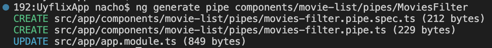
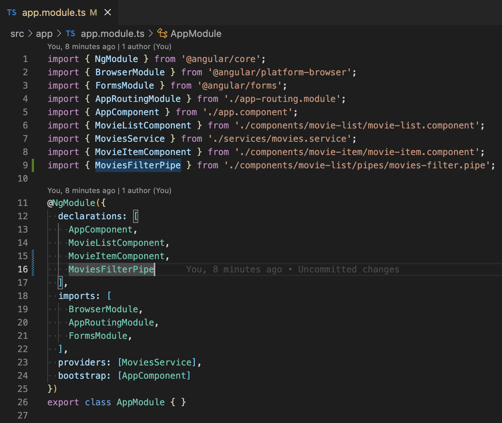
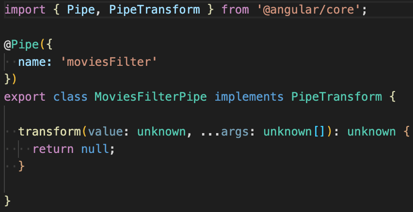
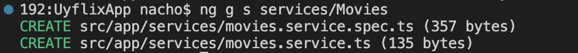
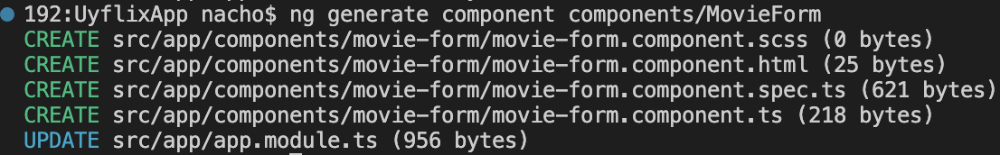
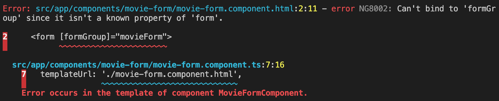

# Guía 2: Custom Pipes y Service Básico

## Custom Pipes: Filtrado en el listado de películas

Como vieron en la guía anterior, Angular ya provee un conjunto de Pipes que vienen integrados y que sirven para transformar los datos antes de mostrarlos en el template (HTML). Ahora van a ver como construir sus propios Pipes personalizados, o *Custom Pipes*.

Van a hacer un `custom pipe` para poder transformar su lista de películas, para poder filtrar las películas por lo que el usuario escriba en el `input` de filtro.
Como es un filtro que solamente van a utilizar para la lista de películas, lo pueden crear en una carpeta adentro de movie-list que se llame pipes.

Van a ejecutar `ng generate pipe components/movie-list/pipes/MoviesFilter`, siendo MoviesFilter el nombre del `pipe`. Este comando va a crear el pipe en la carpeta pipes adentro del componente **movie-list**. Como van a ver, crea 2 archivos. El archivo de test y el pipe. Además, hace un update en el **AppModule**.



Si van al AppModule ahora van a tener, en las **declarations**, el **MoviesFilterPipe**.



Ahora vayan a la clase del pipe. Vean que es una **class** anotada con el decorator `@Pipe()`, que recibe una configuración en formato `JSON` en la que se especifica el name de ese `pipe`, o sea el name con el que lo van a llamar. Esta **class** implementa la interfaz **PipeTransform**, que obliga a definir un método **transform**, que es el que va a tener la lógica para transformar su lista de películas.



Van a acomodar los `types` de los parámetros y el `type` de la salida y van a agregar la lógica.
Lo que van a estar recibiendo es su lista de películas `movies: Movie[] | undefined` y **NO van a recibir una lista de argumentos en este caso**, si no que van a recibir un `filter` de tipo `string` `(filter: string)`.

El código de su filtro les debería quedar algo así:

```typescript
import { Pipe, PipeTransform } from '@angular/core';  // 1) imports
import { Movie } from '../../../models/movie';

// 2) Nos creamos nuestra propia clase MoviesFilterPipe y la decoramos con el decorator @Pipe
@Pipe({
  name: 'moviesFilter'
})
export class MoviesFilterPipe implements PipeTransform { // 3) Implementamos la interfaz PipeTransform

  // 4) Implementamos el método transform de la interfaz PipeTransform
  transform(movies: Movie[] | undefined, filterValue: string): Movie[] {
    // 5) Escribimos el código para filtrar las películas
    // El primer parámetro (movies) es la lista de películas que vamos a transformar
    // El segundo parámetro (filterValue) es el criterio que vamos a utilizar para transformar
    // en este caso vamos a estar filtrando las películas por ese filterValue
    // El retorno es la lista de películas filtradas por filterValue
    if(!movies) {
      return [];
    }
    return movies.filter((movie) => movie.name?.toLowerCase().includes(filterValue?.toLowerCase()));
  }
}
```

Van a usar este CustomPipe en su ```movie-list.component.html```. El código nos quedaría algo así:

```html
<div class="movie-list-container">
    <h2 class="title">Películas</h2>
    <div class="movie-header">
      <input class="filter-input" [(ngModel)]="filterValue" placeholder="Filtrar por" />
    </div>
    <p class="filter" *ngIf="filterValue">
      Películas filtradas por <b>{{ filterValue }}</b>
    </p>
    <div class="list" *ngIf="movies && (movies | moviesFilter: filterValue).length > 0; else elseBlock">
      <app-movie-item
        *ngFor="let movie of movies | moviesFilter: filterValue"
        [movie]="movie"
        (delete)="deleteMovie($event)"
      >
      </app-movie-item>
    </div>
    <ng-template #elseBlock>
      <p class="no-movies-message">No hay películas</p>
    </ng-template>
</div>
```

Siendo:
- moviesFilter: el pipe que acaban de crear.
- filterValue: el string por el cual van a estar filtrando.

Si quisieran pasar más argumentos además del filterValue, los ponen separados por ```:```.

Cómo ven cambió tanto el **ngFor** como el **ngIf** del div.

Por qué cambió el **ngIf**? Porque ahora la lista de películas que están recorriendo en el **ngFor** no es más movies, si no el resultado de hacer `movies | moviesFilter: filterValue`.

### **IMPORTANTE**

Si quieren que el componente pueda usar el `Pipe`, deben declararlo en el AppModule. Siempre que quieran que un `Componente` use un `Pipe`, el módulo en el que declaran ese componente debe referenciar al `Pipe`. En este caso lo hicieron definiendo el `Pipe` en el array `declarations` del decorador `NgModule()` del `AppModule`.

## Servicios e Inyección de Dependencias

Los componentes permiten definir lógica y HTML para una cierta pantalla/vista en particular. Sin embargo, ¿qué hacemos con aquella lógica que no está asociada a una vista en concreto?, o ¿qué hacemos si queremos reusar lógica común a varios componentes (por ejemplo la lógica de conexión contra una API, lógica de manejo de la sesión/autenticación)?

Para lograr eso, van a construir **servicios**. Y a su vez, van a usar **inyección de dependencias** para poder inyectar esos servicios en dichos componentes.

Definiendo servicios, son simplemente clases con un fin en particular. Los van a usar para aquellas `features` que son independientes de un componente en concreto, para reusar lógica o datos a través de componentes o para encapsular interacciones externas. Al cambiar estas responsabilidades y llevarlas a los servicios, su código va a ser más fácil de testear, debuggear y mantener.

Angular trae un `Injector` *built-in*, que les va a permitir registrar sus servicios en sus componentes, y que estos sean `Singleton`. Este `Injector` funciona en base a un contenedor de inyección de dependencias, donde una vez estos se registran, se mantiene una única instancia de cada uno.

Hay 2 formas de hacer que un `service` sea `singleton` en **Angular**:
- Setear el `providedIn: 'root'` como property en el decorator `@Injectable()`
- Incluir el servicio en el `AppModule` o en un módulo que solo sea importado en el `AppModule`.

Supongan que tienen 3 servicios: svc, log y math. Una vez un componente utilice uno de dichos servicios en su constructor, el Angular Injector le provee la instancia del mismo al componente.


### Construyendo un servicio

Para armar un servicio precisan:
- Crear la clase del servicio.
- Definir la metadata con un @, es decir un decorador.
- Importar lo que precisen.
¿Familiar? Son los mismos pasos que han seguido para construir sus componentes y sus custom pipes :)

Antes de crear el servicio van a crear una carpeta `interfaces` adentro de `src/app` para manejar los DTOs/interfaces que quieran crear.
Adentro de esa carpeta van a crear un archivo llamado `create-movie.interface.ts` y adentro van a colocar el siguiente código:

```javascript
export interface ICreateMovie {
    name: string;
    category: string;
    director: string;
    country: string;
    year: number;
    rating: number;
}

```

Esta `interface` la van a necesitar para crear una movie ya que, si se fijan, no tiene el atributo id, porque de eso se va a encargar el backend.

### 1) Creando el servicio

Van a `src/app/services` y crean un nuevo archivo: `movies.service.ts`.

O en la terminal ejecutan: `ng generate service services/Movies` (esto les crea la carpeta services y dos archivos: el de test y el la clase del servicio).



La versión corta es: `ng g s services/Movies`

### **IMPORTANTE**
No se olviden de registrar el servicio como **provider** en el **módulo**, en este caso en el `AppModule`. Esto lo vamos a hacer más adelante.

En la clase del servicio **MoviesService** (`src/app/services/movies.service.ts`) van a reemplazar el código existente por el siguiente código:

```typescript
import { Injectable } from '@angular/core';
import { ICreateMovie } from '../interfaces/create-movie.interface';
import { Movie } from '../models/movie';

@Injectable({
  providedIn: 'root'
})
export class MoviesService {

  private _movies: Movie[] | undefined;
  constructor() { 
    this._movies = this.initializeMovies();
  }

  public getMovies(): Movie[] {
    return this._movies ?? [];
  }

  public getMovieById(id: number): Movie | undefined {
    return this._movies?.find((movie) => movie.id.toString() === id?.toString());
  }

  public postMovie(movieToAddDto: ICreateMovie): number {
    if(!this._movies) this._movies = [];
    const max = Math.max(...this._movies.map(movie => movie.id));
    const id = max + 1;
    const movieToAdd = new Movie(id, movieToAddDto.name, movieToAddDto.category,
      movieToAddDto.director, movieToAddDto.country, movieToAddDto.year, movieToAddDto.rating);
    this._movies.push(movieToAdd);
    return id;
  }

  public putMovie(movieToUpdate: Movie): Movie | undefined {
    this._movies = this._movies?.map(movie => {
      if(movie.id === movieToUpdate?.id) {
        return {
          ...movie,
          name: movieToUpdate.name,
          category: movieToUpdate.category,
          director: movieToUpdate.director,
          country: movieToUpdate.country,
          year: movieToUpdate.year,
          rating: movieToUpdate.rating,
        };
      }
      return movie;
    });
    return this._movies?.find((movie) => movie.id === movieToUpdate?.id);
  }

  public deleteMovie(movieId: number): boolean {
    const movie = this._movies?.find(movie => movie.id === movieId);
    if(!!movie) {
      this._movies = this._movies?.filter(movie => movie.id !== movieId);
      return true;
    }
    return false;
  }

  private initializeMovies(): Movie[] {
    return [
      new Movie(1, "La Era de Hielo", "Animada", "Chris Wedge y Carlos Saldanha", "Estados Unidos", 2002, 5),
      new Movie(2, "El Aro", "Terror", "Gore Verbinski", "Estados Unidos", 2002, 4),
      new Movie(3, "Rápido y Furioso", "Acción", "Rob Cohen", "Estados Unidos", 2001, 3),
      new Movie(4, "Joker", "Suspenso", "Todd Phillips", "Estados Unidos", 2019, 4),
      new Movie(5, "Bajocero", "Suspenso", "Lluís Quílez", "España", 2021, 2),
    ];
  }
}
```

El servicio tiene básicamente el CRUD de movies que van a estar utilizando, simulando un servicio real. Lo van a estar utilizando mientras tanto, antes de que vean cómo conectarse con la `API`.

### 2) Registrando el servicio a través de un provider

Para registrar el servicio en el componente, deben registrar un `Provider`. Un `provider` es simplemente código que puede crear o retornar un servicio, **típicamente es la clase del servicio mismo**. Esto lo logran a través de definirlo en el componente, o como metadata en el Angular Module (AppModule).

- Si lo registran en un componente, pueden inyectar el servicio en el componente y en todos sus hijos. 
- Si lo registran en el módulo de la aplicación, lo pueden inyectar en toda la aplicación.

En este caso, lo van a registrar en el Root Module (`AppModule`). Por ello, van a `app.module.ts` y reemplazan todo el código para dejarlo así:

```javascript
import { NgModule } from '@angular/core';
import { BrowserModule } from '@angular/platform-browser';
import { FormsModule } from '@angular/forms';
import { AppRoutingModule } from './app-routing.module';
import { AppComponent } from './app.component';
import { MovieListComponent } from './components/movie-list/movie-list.component';
import { MovieItemComponent } from './components/movie-item/movie-item.component';
import { MoviesFilterPipe } from './components/movie-list/pipes/movies-filter.pipe';
import { MoviesService } from './services/movies.service';

@NgModule({
  declarations: [
    AppComponent,
    MovieListComponent,
    MovieItemComponent,
    MoviesFilterPipe
  ],
  imports: [
    BrowserModule,
    AppRoutingModule,
    FormsModule,
  ],
  providers: [MoviesService],
  bootstrap: [AppComponent]
})
export class AppModule { }

```

### 3) Inyectando el servicio en el MovieListComponent

La inyección la logran a través del constructor de la clase, para ello hacen lo siguiente en el archivo `movie-list.component.ts`:

Primero el import:

```typescript
import { MoviesService } from '../../services/movies.service';
```
Y luego definen el constructor que inyecta el servicio a la clase:
```typescript
constructor(private _moviesService: MoviesService) {
    // esta forma de escribir el parámetro en el constructor lo que hace es:
    // 1) declara un parámetro de tipo MoviesService en el constructor
    // 2) declara un atributo de clase privado llamado _moviesService
    // 3) asigna el valor del parámetro al atributo de la clase
}
``` 

Así inyectan el `MoviesService` y lo dejan disponible para la clase. Ahí mismo podrían inicializar la lista de películas, llamando al `getMovies` del servicio. Sin embargo, no es proljo mezclar la lógica de construcción del componente (todo lo que es renderización de la vista), con lo que es la lógica de obtención de datos. Para resover esto debeían usar `Hooks` particularmente, el `OnInit`, que se ejecuta luego de inicializar el componente.

Acá pueden aprender más sobre hooks: https://angular.io/guide/lifecycle-hooks

```typescript
public ngOnInit(): void {
    // cuando inicia el componente llamo al servicio para obtener las películas
    this.movies = this._moviesService.getMovies();
}
```
También tienen que actualizar el `deleteMovie` para que no borre sobre la lista de películas que tienen en el componente, si no que llame al `service` para borrarla.

El `deleteMovie` quedaría de la siguiente manera:

```typescript
public deleteMovie(movieToDelete: Movie): void {
    // voy a borrar la película
    const movieWasDeleted = this._moviesService.deleteMovie(movieToDelete?.id);
    if(movieWasDeleted) { // si se borró correctamente, actualizo la lista de películas
      this.movies = this._moviesService.getMovies();
    }
}
```

**Por qué tienen que hacer el `getMovies` nuevamente?** Porque al llamar al `service` están borrando sobre la colección de `movies` del `service` y necesitan actualizar la colección de movies que tiene el componente. Para esto consultan al servicio que es `The Source of Truth` (más adelante tendrían que consultar a la **API**).

El código completo del componente quedaría algo así:
```typescript
import { Component, OnInit } from '@angular/core';
import { MoviesService } from '../../services/movies.service';
import { Movie } from '../../models/movie';

@Component({
  selector: 'app-movie-list',
  templateUrl: './movie-list.component.html',
  styleUrls: ['./movie-list.component.css']
})
export class MovieListComponent implements OnInit {

  public filterValue: string = '';
  public movies: Movie[] = [];

  constructor(
    private _moviesService: MoviesService,
  ) { }

  public ngOnInit(): void {
    // cuando inicia el componente llamo al servicio para obtener las películas
    this.movies = this._moviesService.getMovies();
  }

  public deleteMovie(movieToDelete: Movie): void {
    // voy a borrar la película
    const movieWasDeleted = this._moviesService.deleteMovie(movieToDelete?.id);
    if(movieWasDeleted) { // si se borró correctamente, actualizo la lista de películas
      this.movies = this._moviesService.getMovies();
    }
  }
}
```

## **Navegación entre componentes, Router, reutilización de componentes, Formulario, FormControls y validación de Formularios**

Ejecuten `ng generate component components/MovieForm` para que cree el componente `MovieForm` en la carpeta `components`

Ese comando crea 4 archivos y actualiza el AppModule, agregando el `MovieFormComponent` a la lista de `declarations` del `AppModule`:



Van a `src/app/components/movie-form` y entrar a `movie-form-component.ts`.

Para el `Form` van a utilizar `FormGroup` que les va a ayudar a agrupar los inputs del formulario y mantener el **estado de validación** del mismo. El `FormGroup` va a recibir una colección de `FormControl` de la siguiente manera:

```typescript
{
    [key: string]: new FormControl('initialValue', [Validators]),
}
```

`key` va a ser el identificador del `FormControl` y `[Validators]`, la lista de validadores.

Para este ejemplo van a utilizar `Validators.required` porque todos los inputs van a ser `required` y van a ver cómo crear sus propios `Validators`.

Por poner un ejemplo, algo que podrían querer validar es que en los campos de texto el usuario no ingrese solo espacios.

Para esto crean una carpeta `validators` en `src/app/validators`. Crean un archivo con nombre `string.validator.ts` y van a colocar el siguiente código:

```typescript
import { AbstractControl } from '@angular/forms';

export function ValidateString(control: AbstractControl): { invalidString: boolean } | null {
  if (control.value?.trim()?.length === 0) {
    return { invalidString: true };
  }
  return null;
}

```
El `Validator` simplemente es una función que recibe el control y va a retornar una objeto con una `key` y `true` en caso de que no sea válido.
Para acceder al `value` del `control` hacen control.value, para sacarle los espacios usan la función `trim()` y si el texto resultante de haberle aplicado la función `trim` queda de largo 0, entonces dicen que es inválido, retornando el objeto con `key` **invalidString**. De esta forma **`Angular`** coloca en el objeto `errors`, el objeto que acaban de retornar. Es por eso que en el caso en el que sea válido no retornan un objeto, si no que retornan `null`.

Vuelvan al `movie-form-component.ts`. Van a crear ahora el `FormGroup`. El código les debería quedar de la siguiente manera:

```typescript
public actualYear = new Date().getFullYear();

public movieForm = new FormGroup({
      name: new FormControl<string | undefined>(undefined, [Validators.required, ValidateString]),
      category: new FormControl<string | undefined>(undefined, [Validators.required, ValidateString]),
      director: new FormControl<string | undefined>(undefined, [Validators.required, ValidateString]),
      country: new FormControl<string | undefined>(undefined, [Validators.required, ValidateString]),
      year: new FormControl<number | undefined>(undefined, [Validators.required, Validators.min(1970), Validators.max(this.actualYear)]),
      rating: new FormControl<number | undefined>(undefined, [Validators.required, Validators.min(1), Validators.max(5)]),
  });
```

Y estos son los imports que necesitan hacer:

```typescript
import { FormControl, FormGroup, Validators } from '@angular/forms';
import { ValidateString } from '../../validators/string.validator';
```

`actualYear` es una variable que tiene el año actual para poder utilizarlo al validar el valor máximo que puede tomar el input `year`.

Lo siguiente que ven es el `movieForm` que es un `FormGroup`, que recibe un objeto con todos los `controls`, que van a ser `FormControl`. A cada uno le asignan una `key` para identificarlo dentro del `FormGroup`. Cada `FormControl` va a recibir como primer parámetro, el valor inicial. En este caso van a inicializar cada input como `undefined`, es decir, no definido. El segundo parámetro que recibe el `FormControl` es la lista de `Validators`. En el caso de los inputs de tipo `text` van a utilizar los validators: 
```typescript
[Validators.required, ValidateString]
```

En el caso de los inputs de tipo `number`, además del validator `Validators.required`, van a utilizar los `Validators.min()` y `Validators.max()` para especificar el rango válido.

Para mostrar los errores en la vista, van a necesitar acceder a los controls de cada input. Para esto van a crear los get correspondientes:

```typescript
public get name() { return this.movieForm.get('name'); }

public get category() { return this.movieForm.get('category'); }

public get director() { return this.movieForm.get('director'); }

public get country() { return this.movieForm.get('country'); }

public get year() { return this.movieForm.get('year'); }

public get rating() { return this.movieForm.get('rating'); }
```

Lo otro que necesitan es una función para cuando el usuario submitee el `form`.
Por ahora en la función van a poner unos logs para ver qué les llega.

El código de la función nos quedaría así:

```typescript
public createMovie(): void {
    console.log(this.movieForm);
    console.log({valid: this.movieForm.valid});
    console.log({
      name: this.movieForm.value.name,
      category: this.movieForm.value.category,
      director: this.movieForm.value.director,
      country: this.movieForm.value.country,
      year: this.movieForm.value.year,
      rating: this.movieForm.value.rating,
    });
}
```

El código del componente hasta ahora sería:

```typescript
import { Component } from '@angular/core';
import { FormControl, FormGroup, Validators } from '@angular/forms';
import { ValidateString } from '../../validators/string.validator';

@Component({
  selector: 'app-movie-form',
  templateUrl: './movie-form.component.html',
  styleUrls: ['./movie-form.component.css']
})
export class MovieFormComponent {

  public actualYear = new Date().getFullYear();

  public movieForm = new FormGroup({
      name: new FormControl<string | undefined>(undefined, [Validators.required, ValidateString]),
      category: new FormControl<string | undefined>(undefined, [Validators.required, ValidateString]),
      director: new FormControl<string | undefined>(undefined, [Validators.required, ValidateString]),
      country: new FormControl<string | undefined>(undefined, [Validators.required, ValidateString]),
      year: new FormControl<number | undefined>(undefined, [Validators.required, Validators.min(1970), Validators.max(this.actualYear)]),
      rating: new FormControl<number | undefined>(undefined, [Validators.required, Validators.min(1), Validators.max(5)]),
  });

  constructor() { }

  public get name() { return this.movieForm.get('name'); }

  public get category() { return this.movieForm.get('category'); }

  public get director() { return this.movieForm.get('director'); }

  public get country() { return this.movieForm.get('country'); }

  public get year() { return this.movieForm.get('year'); }

  public get rating() { return this.movieForm.get('rating'); }

  public createMovie(): void {
    console.log(this.movieForm);
    console.log({valid: this.movieForm.valid});
    console.log({
      name: this.movieForm.value.name,
      category: this.movieForm.value.category,
      director: this.movieForm.value.director,
      country: this.movieForm.value.country,
      year: this.movieForm.value.year,
      rating: this.movieForm.value.rating,
    });
  }
}
```

Van a agregar el html a al archivo `movie-list.component.html`.

Este es el HTML:

```html
<div class="form">
    <form [formGroup]="movieForm">
        <div class="form-item">
            <div class="form-item-control">
                <label class="form-item-label" for="name">Nombre</label>
                <input class="form-item-input" formControlName="name" id="name"
                [ngClass]="{ 'input-error': name?.invalid && (name?.dirty || name?.touched) }" />
            </div>
            <div *ngIf="name?.invalid && (name?.dirty || name?.touched)" class="alert-danger">
                <div *ngIf="name?.errors?.['required'] || name?.errors?.['invalidString']">
                    Debe ingresar un nombre.
                </div>
            </div>
        </div>
        <div class="form-item">
            <div class="form-item-control">
                <label class="form-item-label" for="category">Categoría</label>
                <input class="form-item-input" formControlName="category" id="category"
                [ngClass]="{ 'input-error': category?.invalid && (category?.dirty || category?.touched) }" />
            </div>
            <div *ngIf="category?.invalid && (category?.dirty || category?.touched)" class="alert-danger">
                <div *ngIf="category?.errors?.['required'] || category?.errors?.['invalidString']">
                    Debe ingresar una categoría.
                </div>
            </div>
        </div>
        <div class="form-item">
            <div class="form-item-control">
                <label class="form-item-label" for="director">Director</label>
                <input class="form-item-input" formControlName="director" id="director"
                [ngClass]="{ 'input-error': director?.invalid && (director?.dirty || director?.touched) }" />
            </div>
            <div *ngIf="director?.invalid && (director?.dirty || director?.touched)" class="alert-danger">
                <div *ngIf="director?.errors?.['required'] || director?.errors?.['invalidString']">
                    Debe ingresar un director.
                </div>
            </div>
        </div>
        <div class="form-item">
            <div class="form-item-control">
                <label class="form-item-label" for="country">País</label>
                <input class="form-item-input" formControlName="country" id="country"
                [ngClass]="{ 'input-error': country?.invalid && (country?.dirty || country?.touched) }" />
            </div>
            <div *ngIf="country?.invalid && (country?.dirty || country?.touched)" class="alert-danger">
                <div *ngIf="country?.errors?.['required'] || country?.errors?.['invalidString']">
                    Debe ingresar un país.
                </div>
            </div>
        </div>
        <div class="form-item">
            <div class="form-item-control">
                <label class="form-item-label" for="year">Año</label>
                <input class="form-item-input" formControlName="year" id="year" type="number"
                [ngClass]="{ 'input-error': year?.invalid && (year?.dirty || year?.touched) }" />
            </div>
            <div *ngIf="year?.invalid && (year?.dirty || year?.touched)" class="alert-danger">
                <div *ngIf="year?.errors?.['required']">
                    Debe ingresar un año.
                </div>
                <div *ngIf="year?.errors?.['min'] || year?.errors?.['max']">
                    El año debe ser entre 1970 y {{ actualYear }}.
                </div>
            </div>
        </div>
        <div class="form-item">
            <div class="form-item-control">
                <label class="form-item-label" for="rating">Puntuación</label>
                <input class="form-item-input " formControlName="rating" id="rating" type="number"
                [ngClass]="{ 'input-error': rating?.invalid && (rating?.dirty || rating?.touched) }" />
            </div>
            <div *ngIf="rating?.invalid && (rating?.dirty || rating?.touched)" class="alert-danger">
                <div *ngIf="rating?.errors?.['required']">
                    Debe ingresar una puntuación.
                </div>
                <div *ngIf="rating?.errors?.['min'] || rating?.errors?.['max']">
                    La puntuación es del 1 al 5.
                </div>
            </div>
        </div>
        <div class="form-item">
            <button class="button" (click)="createMovie()">Crear</button>
        </div>
    </form>
</div>
```

En el HTML pueden ver un div, que es el contenedor y adentro ya tiene el `form`, que va a recibir como `input property` el `formGroup`:
 ```html
 <form [formGroup]="movieForm">
```

Adentro del `form` van a ver un div que es el contenedor de cada `form-item`.

```html
<div class="form-item">
    <div class="form-item-control">
        <label class="form-item-label" for="name">Nombre</label>
        <input class="form-item-input" formControlName="name" id="name"
        [ngClass]="{ 'input-error': name?.invalid && (name?.dirty || name?.touched) }" />
    </div>
    <div *ngIf="name?.invalid && (name?.dirty || name?.touched)" class="alert-danger">
        <div *ngIf="name?.errors?.['required'] || name?.errors?.['invalidString']">
            Debe ingresar un nombre.
        </div>
    </div>
</div>
```

Cada `form-item` va a tener:
1. Un div que es el contenedor de cada `form-item-control` que adentro va a tener:

    a) El `label`.

    b) El `input`.
    
    Al `input` le van a setear el `formControlName` con la `key` del control correspondiente. En el caso del input del **name** van a pasarle la **key** `name` que fue la **key** que usaron para identificar el control del name.

    Y un `[ngClass]` para que agregue una clase de css en caso de que se cumpla una condición. La condición va a ser si el control es inválido y está *dirty* o *touched*.
    
    - *dirty* significa que el usuario hizo una modificación.
    - *touched* significa que el usuario entró al `input`.

    La clase es `input-error` y lo que va a hacer es marcar el borde del `input` en rojo, en caso de que haya un error.

2. Otro div, que es el contenedor del mensaje de error. El div tiene un **ngIf** con la misma condición que el `ngClass` que vieron recién.

    Dentro de este div van a tener otro div con la condición para que se muestre el mensaje. En el caso del control `name` solo van a tener un mensaje pero en otros control van a tener más de uno.
    
    El mensaje lo va a mostrar, en este caso, siempre y cuando el objeto `errors` del control tenga la `key` *required* o *invalidString*

    En el caso de `year` y `rating` van a tener 2 mensajes.

Para poder hacer el `bind` de la property `formGroup` van a necesitar importar `ReactiveFormsModule` en el `AppModule`.

En caso contrario al compilar la app, les va a salir el siguiente error:



Después de hacer el import, el `AppModule` debería quedar así:

```typescript
import { NgModule } from '@angular/core';
import { BrowserModule } from '@angular/platform-browser';
import { FormsModule, ReactiveFormsModule } from '@angular/forms';

import { AppRoutingModule } from './app-routing.module';
import { AppComponent } from './app.component';
import { MovieListComponent } from './components/movie-list/movie-list.component';
import { MovieItemComponent } from './components/movie-item/movie-item.component';
import { MoviesFilterPipe } from './components/movie-list/pipes/movies-filter.pipe';
import { MoviesService } from './services/movies.service';
import { MovieFormComponent } from './components/movie-form/movie-form.component';

@NgModule({
  declarations: [
    AppComponent,
    MovieListComponent,
    MovieItemComponent,
    MoviesFilterPipe,
    MovieFormComponent,
  ],
  imports: [
    BrowserModule,
    AppRoutingModule,
    FormsModule,
    ReactiveFormsModule,
  ],
  providers: [MoviesService],
  bootstrap: [AppComponent]
})
export class AppModule { }
```

Para poder acceder al `MovieForm` van a tener que generar la ruta al componente. En la clase pasada crearon un `app-routing.module.ts` para manejar las rutas de la app.

En el array de routes van a agregar lo siguiente:
```typescript
{ path: MOVIE_FORM_URL, component: MovieFormComponent },
```

El `app-routing.module.ts` completo nos quedaría de la siguiente forma:

```typescript
import { NgModule } from '@angular/core';
import { RouterModule, Routes } from '@angular/router';
import { MovieListComponent } from './components/movie-list/movie-list.component';
import { MOVIE_FORM_URL, MOVIE_LIST_URL } from './utils/routes';
import { MovieFormComponent } from './components/movie-form/movie-form.component';

const routes: Routes = [
  { path: '', component: MovieListComponent },
  { path: MOVIE_LIST_URL, component: MovieListComponent },
  { path: MOVIE_FORM_URL, component: MovieFormComponent },
  { path: '**', redirectTo: '' }, // this line goes at the end
];

@NgModule({
  imports: [RouterModule.forRoot(routes)],
  exports: [RouterModule]
})
export class AppRoutingModule { }
```

Ahora falta agregar un botón que lleve al usuario a esa ruta.

Para esto van a ir al `movie-list.component.ts` y van a agregar el botón de `Agregar Película`.

La función para navegar a la página del `MovieForm` les va a quedar de la siguiente manera:
```typescript
public navigateToAddMovie(): void {
    console.log(`going to navigate to /${ADD_MOVIE_URL}`);
    this._router.navigateByUrl(`/${ADD_MOVIE_URL}`);
  }
```
Para poder navegar necesitan inyectar el `Router`, por lo que el constructor les debería quedar de la siguiente manera:

```typescript
constructor(
    private _moviesService: MoviesService,
    private _router: Router,
) { }
```

Para poder inyectar el `Router`, necesitan hacer este import:
```typescript
import { Router } from '@angular/router';
```

Ahora van al HTML (`movie-list.component.html`). Van a modificar el `movie-header` para agregar el botón de `Agregar Película`.

El `movie-header` quedaría de la siguiente manera:

```html
<div class="movie-list-header">
    <input class="movie-list-filter-input" [(ngModel)]="filterValue" placeholder="Filtrar por" />
    <button class="movie-list-button" (click)="navigateToAddMovie()">Agregar Película</button>
</div>
```

Ahora están en condiciones de probar la navegación al `MovieForm`.

Lo siguiente que van a hacer es agregar la lógica al `createMovie` del componente **MovieForm**, para que agregue la película a la colección de `movies` que tienen en el `servicio`.

El `createMovie` va a quedar de la siguiente manera:

```typescript
public createMovie(): void {
    console.log(this.movieForm);
    console.log({isFormValid: this.movieForm.valid});
    if(this.movieForm.valid) {
      const movie: ICreateMovie = {
        name: this.movieForm.value.name as string,
        category: this.movieForm.value.category as string,
        director: this.movieForm.value.director as string,
        country: this.movieForm.value.country as string,
        year: this.movieForm.value.year as number,
        rating: this.movieForm.value.rating as number,
      };
      console.log({movie});
      const movieId = this._moviesService.postMovie(movie);
      console.log({movieId});
      if(!!movieId) {
        alert('Película creada!!');
        this._location.back();
      }
    }
  }
```

Si el `movieForm` es válido, van a armar el objeto `movie`, que va a ser de tipo `ICreateMovie` (como lo requiere el servicio), con los datos del `movieForm`. **Es importante que hagan la verificación de si el formulario es válido**, ya que necesitan castear el valor de cada `control` a su respectivo tipo, ya que el `control` puede ser de ese tipo, o **null** o **undefined**. Para que la verificación funcione como esperan, deben usar los `Validators`.

Una vez creado el objeto `movie`, van a llamar al servicio de películas, para hacer lo que sería el "post" de esa `movie`.

Si el servicio les retorna un id de película, van a mostrar un alert de que se creó la película y van a redirigir al usuario a la lista de películas, yendo hacia atrás en el navigation history. Para ir hacia atrás, van a usar `Location` de **@angular/common**

Para que compile lo que agregaron a la función de `createMovie`, van a tener que hacer los siguientes imports:

```typescript
import { Location } from '@angular/common';
import { ICreateMovie } from '../../interfaces/create-movie.interface';
import { MoviesService } from '../../services/movies.service';
```

Y el constructor del componente va a quedar así:

```typescript
constructor(
    private _location: Location,
    private _moviesService: MoviesService,
) { }
```

Ahora están en condiciones de probar el `createMovie`.

El código completo del componente **MovieForm** les debería haber quedado de la siguiente manera:

```typescript
import { Component } from '@angular/core';
import { FormControl, FormGroup, Validators } from '@angular/forms';
import { Location } from '@angular/common';
import { ValidateString } from '../../validators/string.validator';
import { ICreateMovie } from '../../interfaces/create-movie.interface';
import { MoviesService } from '../../services/movies.service';

@Component({
  selector: 'app-movie-form',
  templateUrl: './movie-form.component.html',
  styleUrls: ['./movie-form.component.scss']
})
export class MovieFormComponent {
  public actualYear = new Date().getFullYear();

  public movieForm = new FormGroup({
      name: new FormControl<string | undefined>(undefined, [Validators.required, ValidateString]),
      category: new FormControl<string | undefined>(undefined, [Validators.required, ValidateString]),
      director: new FormControl<string | undefined>(undefined, [Validators.required, ValidateString]),
      country: new FormControl<string | undefined>(undefined, [Validators.required, ValidateString]),
      year: new FormControl<number | undefined>(undefined, [Validators.required, Validators.min(1970), Validators.max(this.actualYear)]),
      rating: new FormControl<number | undefined>(undefined, [Validators.required, Validators.min(1), Validators.max(5)]),
  });

  constructor(
    private _location: Location,
    private _moviesService: MoviesService,
  ) { }

  public get name() { return this.movieForm.get('name'); }

  public get category() { return this.movieForm.get('category'); }

  public get director() { return this.movieForm.get('director'); }

  public get country() { return this.movieForm.get('country'); }

  public get year() { return this.movieForm.get('year'); }

  public get rating() { return this.movieForm.get('rating'); }

  public createMovie(): void {
    console.log(this.movieForm);
    console.log({isFormValid: this.movieForm.valid});
    if(this.movieForm.valid) {
      const movie: ICreateMovie = {
        name: this.movieForm.value.name as string,
        category: this.movieForm.value.category as string,
        director: this.movieForm.value.director as string,
        country: this.movieForm.value.country as string,
        year: this.movieForm.value.year as number,
        rating: this.movieForm.value.rating as number,
      };
      console.log({movie});
      const movieId = this._moviesService.postMovie(movie);
      console.log({movieId});
      if(!!movieId) {
        alert('Película creada!!');
        this._location.back();
      }
    }
  }
}
```
